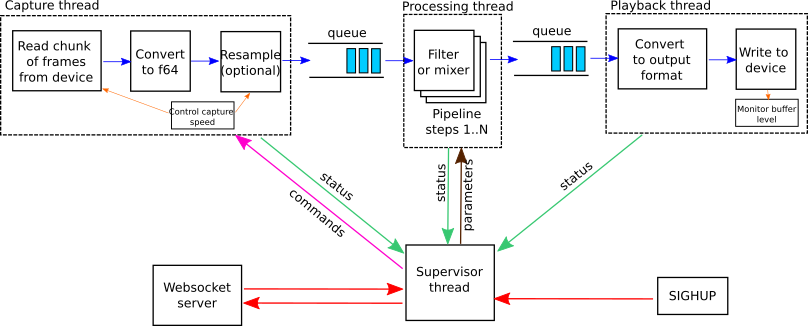
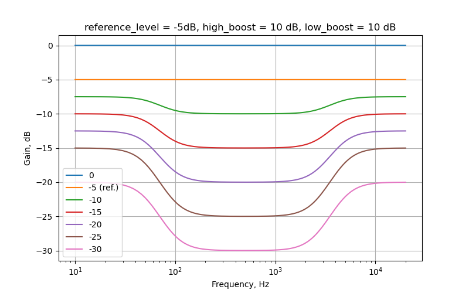

# CamillaDSP v3.0


A tool to create audio processing pipelines for applications such as active crossovers or room correction.
It is written in Rust to benefit from the safety and elegant handling of threading that this language provides.

Supported platforms: Linux, macOS, Windows.

Audio data is captured from a capture device and sent to a playback device.
Alsa, PulseAudio, Jack, Wasapi and CoreAudio are currently supported for both capture and playback.

The processing pipeline consists of any number of filters and mixers.
Mixers are used to route audio between channels and to change the number of channels in the stream.
Filters can be both IIR and FIR. IIR filters are implemented as biquads, while FIR use convolution via FFT/IFFT.
A filter can be applied to any number of channels. All processing is done in chunks of a fixed number of samples.
A small number of samples gives a small in-out latency while a larger number is required for long FIR filters.
The full configuration is given in a YAML file.

# Disclaimer

CamillaDSP is distributed under the [GNU GENERAL PUBLIC LICENSE Version 3](LICENSE.txt).

This includes the following disclaimer:
>  15. Disclaimer of Warranty.
>
>  THERE IS NO WARRANTY FOR THE PROGRAM, TO THE EXTENT PERMITTED BY
>APPLICABLE LAW.  EXCEPT WHEN OTHERWISE STATED IN WRITING THE COPYRIGHT
>HOLDERS AND/OR OTHER PARTIES PROVIDE THE PROGRAM "AS IS" WITHOUT WARRANTY
>OF ANY KIND, EITHER EXPRESSED OR IMPLIED, INCLUDING, BUT NOT LIMITED TO,
>THE IMPLIED WARRANTIES OF MERCHANTABILITY AND FITNESS FOR A PARTICULAR
>PURPOSE.  THE ENTIRE RISK AS TO THE QUALITY AND PERFORMANCE OF THE PROGRAM
>IS WITH YOU.  SHOULD THE PROGRAM PROVE DEFECTIVE, YOU ASSUME THE COST OF
>ALL NECESSARY SERVICING, REPAIR OR CORRECTION.
>
>  16. Limitation of Liability.
>
>  IN NO EVENT UNLESS REQUIRED BY APPLICABLE LAW OR AGREED TO IN WRITING
>WILL ANY COPYRIGHT HOLDER, OR ANY OTHER PARTY WHO MODIFIES AND/OR CONVEYS
>THE PROGRAM AS PERMITTED ABOVE, BE LIABLE TO YOU FOR DAMAGES, INCLUDING ANY
>GENERAL, SPECIAL, INCIDENTAL OR CONSEQUENTIAL DAMAGES ARISING OUT OF THE
>USE OR INABILITY TO USE THE PROGRAM (INCLUDING BUT NOT LIMITED TO LOSS OF
>DATA OR DATA BEING RENDERED INACCURATE OR LOSSES SUSTAINED BY YOU OR THIRD
>PARTIES OR A FAILURE OF THE PROGRAM TO OPERATE WITH ANY OTHER PROGRAMS),
>EVEN IF SUCH HOLDER OR OTHER PARTY HAS BEEN ADVISED OF THE POSSIBILITY OF
>SUCH DAMAGES.

In short this means that the user is responsible for any damage resulting from using this program.
It does not matter if the damage is caused by incorrect usage or a bug in the software.

# Table of Contents
**[Introduction](#introduction)**
- **[Background](#background)**
- **[How it works](#how-it-works)**
- **[System requirements](#system-requirements)**
- **[Usage example: crossover for 2-way speakers](#usage-example-crossover-for-2-way-speakers)**
- **[Dependencies](#dependencies)**
- **[Companion libraries and tools](#companion-libraries-and-tools)**
- **[GUI](#gui)**

**[Installing](#installing)**

**[Building](#building)**
- **[Build with standard features](#building-in-linux-with-standard-features)**
- **[Customized build](#customized-build)**
- **[Optimize for your system](#optimize-for-your-system)**
- **[Building on Windows and macOS](#building-on-windows-and-macos)**

**[How to run](#how-to-run)**
- **[Command line options](#command-line-options)**
- **[Reloading the configuration](#reloading-the-configuration)**
- **[Controlling via websocket](#controlling-via-websocket)**

**[Processing audio](#processing-audio)**
- **[Cross-platform](#cross-platform)**
  - **[Jack](#jack)**
  - **[File or pipe](#file-or-pipe)**
- **[Windows](#windows)**
- **[MacOS (CoreAudio)](#macos-coreaudio)**
- **[Linux](#linux)**
  - **[Alsa](#alsa)**
  - **[PulseAudio](#pulseaudio)**
  - **[Pipewire](#pipewire)**

**[Configuration](#configuration)**
- **[The YAML format](#the-yaml-format)**
- **[Title and description](#title-and-description)**
- **[Volume control](#volume-control)**
- **[Devices](#devices)**
- **[Resampling](#resampling)**
- **[Mixers](#mixers)**
- **[Filters](#filters)**
   - **[Gain](#gain)**
   - **[Volume](#volume)**
   - **[Loudness](#loudness)**
   - **[Delay](#delay)**
   - **[FIR](#fir)**
   - **[IIR](#iir)**
   - **[Dither](#dither)**
   - **[Limiter](#limiter)**
   - **[Difference equation](#difference-equation)**
- **[Processors](#processors)**
   - **[Compressor](#compressor)**
   - **[NoiseGate](#noise-gate)**
- **[Pipeline](#pipeline)**
   - **[Filter step](#filter-step)**
   - **[Mixer and Processor step](#mixer-and-processor-step)**
   - **[Tokens in names](#tokens-in-names)**
   - **[Bypassing steps](#bypassing-steps)**
- **[Using filters from REW](#using-filters-from-rew)**
- **[Visualizing the config](#visualizing-the-config)**

**[Related projects](#related-projects)**

**[Getting help](#getting-help)**
- **[FAQ](#faq)**
- **[Troubleshooting](#troubleshooting)**


# Introduction

## Background
The purpose of CamillaDSP is to enable audio processing with combinations of FIR and IIR filters.
This functionality is available in EqualizerAPO, but for Windows only.
For Linux the best known FIR filter engine is probably BruteFIR, which works very well but doesn't support IIR filters.
The goal of CamillaDSP is to provide both FIR and IIR filtering for Linux, Windows and macOS, to be stable, fast and flexible, and be easy to use and configure.

* BruteFIR: https://torger.se/anders/brutefir.html
* EqualizerAPO: https://sourceforge.net/projects/equalizerapo/
* The IIR filtering is heavily inspired by biquad-rs: https://github.com/korken89/biquad-rs

## How it works
The audio pipeline in CamillaDSP runs in three separate threads.
One thread handles capturing audio, one handles the playback, and one does the processing in between.
The capture thread passes audio to the processing thread via a message queue.
Each message consists of a chunk of audio with a configurable size.
The processing queue waits for audio messages, processes them in the order they arrive,
and passes the processed audio via another message queue to the playback thread.
There is also a supervisor thread for control.
This chart shows the most important parts:



### Capture
The capture thread reads a chunk samples from the audio device in the selected format.
It then converts the samples to 64-bit floats (or optionally 32-bit).
If resampling is enabled, the audio data is sent to the resampler.
At the end, the chunk of samples is packed as a message that is then posted to the input queue of the processing thread.
After this the capture thread returns to reading the next chunk of samples from the device.

### Processing
The processing thread waits for audio chunk messages to arrive in the input queue.
Once a message arrives, it's passed through all the defined filters and mixers of the pipeline.
Once all processing is done, the audio data is posted to the input queue of the playback device.

### Playback
The playback thread simply waits for audio messages to appear in the queue.
Once a message arrives, the audio data is converted to the right sample format for the device, and written to the playback device.
The Alsa playback device supports monitoring the buffer level of the playback device.
This is used to send requests for adjusting the capture speed to the supervisor thread, on a separate message channel.

### Supervisor
The supervisor monitors all threads by listening to their status messages.
The requests for capture rate adjust are passed on to the capture thread.
It's also responsible for updating the configuration when requested to do so via the websocket server or a SIGHUP signal.

### Websocket server
The websocket server launches a separate thread to handle each connected client.
All commands to change the config are sent to the supervisor thread.

## System requirements
CamillaDSP runs on Linux, macOS and Windows.
The exact system requirements are determined by the amount of processing the application requires,
but even relatively weak CPUs like Intel Atom have much more processing power than most will need.

In general, a 64-bit CPU and OS will perform better.

A few examples, done with CamillaDSP v0.5.0:

- A Raspberry Pi 4 doing FIR filtering of 8 channels, with 262k taps per channel, at 192 kHz.
  CPU usage about 55%.

- An AMD Ryzen 7 2700u (laptop) doing FIR filtering of 96 channels, with 262k taps per channel, at 192 kHz.
  CPU usage just under 100%.

### Linux requirements
Both 64 and 32 bit architectures are supported. All platforms supported by the Rustc compiler should work.

Pre-built binaries are provided for:
- x86_64 (almost all PCs)
- armv6 (32-bit arm, for example a Raspberry Pi 1 and Zero)
- armv7 (32-bit arm, for example a Raspberry Pi 2,3,4 with a 32-bit OS)
- aarch64 (64-bit arm, for example Raspberry Pis running a 64 bit OS)

### Windows requirements
An x86_64 CPU and the 64-bit version of Windows is recommended. Any x86_64 CPU will likely be sufficient.

Pre-built binaries are provided for 64-bit systems.

### MacOS requirements
CamillaDSP can run on both Intel and Apple Silicon macs. Any reasonably recent version of MacOS should work.

Pre-built binaries are provided for both Intel and Apple Silicon


## Usage example: crossover for 2-way speakers
A crossover must filter all sound being played on the system.
This is possible with both PulseAudio and Alsa by setting up a loopback device (Alsa) or null sink (Pulse) and setting this device as the default output device.
CamillaDSP is then configured to capture from the output of this device and play the processed audio on the real sound card.

See the [tutorial for a step-by-step guide.](./stepbystep.md)

## Dependencies
These are the key dependencies for CamillaDSP.
* https://crates.io/crates/alsa - Alsa audio backend
* https://crates.io/crates/clap - Command line argument parsing
* https://crates.io/crates/cpal - Jack audio backend
* https://crates.io/crates/libpulse-simple-binding - PulseAudio audio backend
* https://crates.io/crates/realfft - Wrapper for RustFFT that speeds up FFTs of real-valued data
* https://crates.io/crates/rustfft - FFT used for FIR filters
* https://crates.io/crates/rubato - Sample rate conversion
* https://crates.io/crates/serde_yaml - Config file reading
* https://crates.io/crates/tungstenite - Websocket server


## Companion libraries and tools
These projects are part of the CamillaDSP family:
* https://github.com/HEnquist/pycamilladsp - Library for communicating with CamillaDSP over websocket.
* https://github.com/HEnquist/pycamilladsp-plot - Plotting and visualization of configurations.
* https://github.com/HEnquist/camilladsp-config - Example configurations for things like running CamillaDSP as a systemd service.

## GUI
[CamillaGUI](https://github.com/HEnquist/camillagui-backend) is a user interface for CamillaDSP that is accessed via a web browser.


# Installing

The easiest way to install CamillaDSP is to download a pre-built binary.
Binaries for each release are available for the most common systems.
See the ["Releases"](https://github.com/HEnquist/camilladsp/releases) page.
To see the files click "Assets".

These are compressed files containing a single executable file that is ready to run.

The following configurations are provided:

| Filename | Description | Backends |
|----------|-------------|----------|
| `camilladsp-linux-amd64.tar.gz` | Linux on 64-bit Intel or AMD CPU | Alsa, Pulseaudio |
| `camilladsp-linux-armv6.tar.gz` | Linux on Armv6 (32-bit), intended for Raspberry Pi 1 and Pi Zero but should also work on others | Alsa |
| `camilladsp-linux-armv7.tar.gz` | Linux on Armv7 with Neon (32-bit), intended for Raspberry Pi 2 and up but should also work on others | Alsa |
| `camilladsp-linux-aarch64.tar.gz` | Linux on Armv8 (64-bit), intended for Raspberry Pi 3 and up, but should also work on others | Alsa |
| `camilladsp-macos-amd64.tar.gz` | macOS on 64-bit Intel CPU | CoreAudio |
| `camilladsp-macos-aarch64.tar.gz` | macOS on Apple silicon | CoreAudio |
| `camilladsp-windows-amd64.zip` | Windows on 64-bit Intel or AMD CPU | Wasapi |

All builds include the Websocket server.

The `.tar.gz`-files can be uncompressed with the `tar` command:

```sh
tar -xvf camilladsp-linux-amd64.tar.gz
```

## Running downloaded executables on macOS
If the binary was downloaded using Safari, then macOS most likely won't allow it to be executed.
Trying will result in an error message such as:
`"camilladsp" can't be opened because its integrity cannot be verified.`

The solution is to remove the "quarantine" attribute from the binary using the `xattr` command.

Open a a terminal and run:

```sh
xattr -d com.apple.quarantine /path/to/camilladsp
```

# Building

Use recent stable versions of rustc and cargo. The minimum rustc version is 1.61.0.

The recommended way to install rustc and cargo is by using the "rustup" tool.
This tool works on all supported platforms (Linux, macOS and Windows). Get it here: https://rustup.rs/

For Windows you also need the "Build Tools for Visual Studio". Get them from here: https://aka.ms/buildtools

When building on Linux the Alsa backend is always enabled.
Similarly, building on Windows always enables the Wasapi backend.
And building on macOS always enables the CoreAudio backend.

By default both the PulseAudio and Jack backends are disabled, but they can be enabled if desired.
Leaving them disabled also means that the corresponding system Jack/Pulse packages aren't needed.

By default the internal processing is done using 64-bit floats.
There is a possibility to switch this to 32-bit floats.
This might be useful for speeding up the processing when running on a 32-bit CPU (or a 64-bit CPU running in 32-bit mode),
but the actual speed advantage has not been evaluated.
Note that the reduction in precision increases the numerical noise.

CamillaDSP includes a Websocket server that can be used to pass commands to the running process.
This feature is enabled by default, but can be left out. The feature name is "websocket".
For usage see the section "Controlling via websocket".

## Building in Linux with standard features
These instructions assume that the linux distribution used is one of Fedora, Debian, Ubunty or Arch.
They should also work also work on distributions closely related to one of these, such as Manjaro (Arch),
or Raspberry Pi OS (Debian).

There are many others, including some specialized distributions for example targeting audio playback.
These often come with a slimmed down set of preinstalled packages.
Compiling CamillaDSP on one of these may require installing several more packages than the ones listed here.
If possible, it's recommended to use a pre-built binary on these systems.

- Install pkg-config (very likely already installed):
- - Fedora: ```sudo dnf install pkgconf-pkg-config```
- - Debian/Ubuntu etc: ```sudo apt-get install pkg-config```
- - Arch: ```sudo pacman -S cargo pkg-config```
- Install Alsa dependency:
- - Fedora: ```sudo dnf install alsa-lib-devel```
- - Debian/Ubuntu etc: ```sudo apt-get install libasound2-dev```
- - Arch: ```sudo pacman -S alsa-lib```
- Install OpenSSL dependency:
- - Fedora: ```sudo dnf install openssl openssl-devel```
- - Debian/Ubuntu etc: ```sudo apt-get install openssl libssl-dev```
- - Arch:  ```sudo pacman -S openssl```
- Clone the repository
- Build with standard options: ```cargo build --release```
- - see below for other options
- The binary is now available at ./target/release/camilladsp
- Optionally install with `cargo install --path .`
- - Note: the `install` command takes the same options for features as the `build` command.

## Customized build
All the available options, or "features" are:
- `pulse-backend`: PulseAudio support.
- `cpal-backend`: Used for Jack support (automatically enabled when needed).
- `jack-backend`: Jack support (Linux only).
- `bluez-backend`: Bluetooth support via BlueALSA (Linux only).
- `websocket`: Websocket server for control.
- `secure-websocket`: Enable secure websocket, also enables the `websocket` feature.
- `32bit`: Perform all calculations with 32-bit floats (instead of 64).
- `debug`: Enable extra logging, useful for debugging.
- `avoid-rustc-issue-116359`: Enable a workaround for [rust issue #116359](https://github.com/rust-lang/rust/issues/116359).
  Used to check if a performance issue is caused by this compiler bug.


The `websocket` feature is included in the default features, meaning it will be enabled if you don't specify anything.

Cargo doesn't allow disabling a single default feature,
but you can disable the whole group with the `--no-default-features` flag.
Then you have to manually add all the ones you want.

Example 1: You want `websocket` and `pulse-backend`. The first one is included by default so you only need to add `pulse-backend`:
```
cargo build --release --features pulse-backend
(or)
cargo install --path . --features pulse-backend
```

Example 2: You want only `32bit`. Since you don't want `websocket` you have to disable the defaults:
```
cargo build --release --no-default-features --features 32bit
(or)
cargo install --path . --no-default-features --features 32bit
```

### Additional dependencies

The `pulse-backend` feature requires PulseAudio and its development files. To install:
- Fedora: ```sudo dnf install pulseaudio-libs-devel```
- Debian/Ubuntu etc: ```sudo apt-get install libpulse-dev```
- Arch:  ```sudo pacman -S libpulse```

The `jack-backend` feature requires jack and its development files. To install:
- Fedora: ```sudo dnf install jack-audio-connection-kit jack-audio-connection-kit-devel```
- Debian/Ubuntu etc: ```sudo apt-get install jack libjack-dev```
- Arch:  ```sudo pacman -S jack```

## Optimize for your system
By default Cargo builds for a generic system, meaning the resulting binary might not run as fast as possible on your system.
This means for example that it will not use AVX on an x86-64 CPU, or NEON on a Raspberry Pi.

To make an optimized build for your system, you can specify this in your Cargo configuration file.
Or, just set the RUSTFLAGS environment variable by adding RUSTFLAGS='...' in from of the "cargo build" or "cargo install" command.

Make an optimized build on x86-64:
```
RUSTFLAGS='-C target-cpu=native' cargo build --release
```

On a Raspberry Pi also state that NEON should be enabled:
```
RUSTFLAGS='-C target-feature=+neon -C target-cpu=native' cargo build --release
```

## Building on Windows and macOS
The platform-specific backends are always enabled when building on Windows and macOS. The recommended build command is:

macOS:
```
RUSTFLAGS='-C target-cpu=native' cargo build --release
```

Windows (cmd.exe command prompt):
```
set RUSTFLAGS=-C target-cpu=native
cargo build --release
```

Windows (PowerShell):
```
$env:RUSTFLAGS="-C target-cpu=native"
cargo build --release
```

The PulseAudio backend can be used on macOS.
The necessary dependencies can be installed with brew:
```
brew install pkg-config
brew install pulseaudio
```


# How to run

The command is simply:
```
camilladsp /path/to/config.yml
```
This starts the processing defined in the specified config file.
The config is first parsed and checked for errors.
This first checks that the YAML syntax is correct, and then checks that the configuration is complete and valid.
When an error is found it displays an error message describing the problem.
See more about the configuration file below.

## Command line options
Starting with the --help flag prints a short help message:
```
> camilladsp --help
CamillaDSP v3.0.0
Henrik Enquist <henrik.enquist@gmail.com>
A flexible tool for processing audio

Built with features: websocket

Supported device types:
Capture: RawFile, WavFile, Stdin, SignalGenerator, CoreAudio
Playback: File, Stdout, CoreAudio

Usage: camilladsp [OPTIONS] [CONFIGFILE]

Arguments:
  [CONFIGFILE]  The configuration file to use

Options:
  -c, --check                          Check config file and exit
  -s, --statefile <STATEFILE>          Use the given file to persist the state
  -v...                                Increase message verbosity
  -l, --loglevel <LOGLEVEL>            Set log level [possible values: trace, debug, info, warn, error, off]
  -o, --logfile <LOGFILE>              Write logs to the given file path
      --log_rotate_size <ROTATE_SIZE>  Rotate log file when the size in bytes exceeds this value
      --log_keep_nbr <KEEP_NBR>        Number of previous log files to keep
  -a, --address <ADDRESS>              IP address to bind websocket server to
  -p, --port <PORT>                    Port for websocket server
  -w, --wait                           Wait for config from websocket
  -g, --gain <GAIN>                    Initial gain in dB for main volume control
      --gain1 <GAIN1>                  Initial gain in dB for Aux1 fader
      --gain2 <GAIN2>                  Initial gain in dB for Aux2 fader
      --gain3 <GAIN3>                  Initial gain in dB for Aux3 fader
      --gain4 <GAIN4>                  Initial gain in dB for Aux4 fader
  -m, --mute                           Start with main volume control muted
      --mute1                          Start with Aux1 fader muted
      --mute2                          Start with Aux2 fader muted
      --mute3                          Start with Aux3 fader muted
      --mute4                          Start with Aux4 fader muted
  -e, --extra_samples <EXTRA_SAMPLES>  Override number of extra samples in config
  -n, --channels <CHANNELS>            Override number of channels of capture device in config
  -r, --samplerate <SAMPLERATE>        Override samplerate in config
  -f, --format <FORMAT>                Override sample format of capture device in config [possible values: S16LE, S24LE, S24LE3, S32LE, FLOAT32LE, FLOAT64LE]
  -h, --help                           Print help
  -V, --version                        Print version
```

Most flags and options have a long and a short form. For example `--port 1234` and `-p1234` are equivalent.

If the `--check` flag is given, the program will exit after checking the configuration file.
Use this if you only want to verify that the configuration is ok, and not start any processing.

### Logging

The default logging setting prints messages of levels "error", "warn" and "info".
This can be changed with the `loglevel` option.
Setting this to for example `warn` will print messages of level `warn` and above, but suppress the lower levels of `info`, `debug` and `trace`.
Alternatively, the log level can be changed with the verbosity flag.
By passing the verbosity flag once, `-v`, `debug` messages are enabled.
If it's given twice, `-vv`, it also prints `trace` messages.

The log messages are normally written to the terminal via stderr,
but they can instead be written to a file by giving the `--logfile` option.
The argument should be the path to the logfile.
If this file is not writable, CamillaDSP will panic and exit.

Log rotation can be enabled by the `--log_rotate_size` option.
This creates a new log file whenever the log fize size exceeds the given size in bytes.
When rotation is enabled the current log file gets an added infix of `_rCURRENT`,
so for example `logfile.log` becomes `logfile_rCURRENT.log`.
When the file is rotated, the old logs are kept with a timestamp as infix,
for example `logfile_r2023-01-29_12-59-00.log`.
The default is to keep all previous log files,
but this can be limited by setting the `--log_keep_nbr` option to the desired number.

### Persistent storage of state

The `--statefile` option is used to give a path to a file where CamillaDSP will save the config file path, and the volume and mute settings.
On startup, these values will be read from the statefile if the file exists and is valid.
The values in the file will then be kept updated whenever they change.
If the file doesn't exist, it will be created on the first write.

If the `configfile` argument is given, then this will be used instead of the value from the statefile.
Similarly, the `--gain` and `--mute` options also override the values in the statefile for the main fader
while the `--gain1` to `--gain4` and `--mute1` to `--mute4` do the same for the Aux faders.

**Use this feature with caution! The volume setting given in the statefile will be applied immediately when CamillaDSP starts processing.**
In systems that have a gain structure such that a too high volume setting can damage equipment or ears,
it is recommended to always use the `--gain` and `--gain1..4` options to set the volume to start at a safe value.

#### Example statefile
The statefile is a small YAML file that holds the path to the active config file,
as well as mute and volume settings for the five faders (`Main` and `Aux1` to `Aux4`)
```
---
config_path: /path/to/config.yml
mute:
  - false
  - false
  - false
  - false
  - false
volume:
  - 0.0
  - 0.0
  - 0.0
  - 0.0
  - 0.0
```

### Websocket

To enable the websocket server, provide a port number with the `--port` option. Leave it out, or give 0 to disable.

By default the websocket server binds to the address 127.0.0.1 which means it's only accessible locally (to clients running on the same machine).
If it should be also available to remote machines, give the IP address of the interface where it should be available with the `--address` option.
Giving 0.0.0.0 will bind to all interfaces.
If CamillaDSP was built with the "secure-websocket" feature, it has two additional options `--cert` and `--pass`.
These are used to provide an identity, to enable secure websocket connections.
See the [websocket readme for more details.](./websocket.md)

If the "wait" flag, `--wait` is given, CamillaDSP will start the websocket server and wait for a configuration to be uploaded.
Then the config file argument must be left out.

### Overriding config values

There are a few options to override values in the loaded config file.
Giving these options means the provided values will be used instead of the values in any loaded configuration.
To change the values, CamillaDSP has to be restarted.
If the config file has resampling disabled, then overriding the samplerate will change the `samplerate` parameter.
But if resampling is enabled, it will instead change the `capture_samplerate` parameter.
If then `enable_rate_adjust` is false and `capture_samplerate`=`samplerate`, then resampling will be disabled.
When overriding the samplerate, two other parameters are scaled as well.
Firstly, the `chunksize` is multiplied or divided by integer factors to try to keep the pipeline running at a constant number of chunks per second.
Secondly, the value of `extra_samples` is scaled to give the extra samples the same duration at the new samplerate.
But if the `extra_samples` override is used, the given value is used without scaling it.


### Initial volume

The `--gain` and `--gain1..4` options can accept negative values,
but this requires a little care since the minus sign can be misinterpreted as another option.
It works as long as there is no space in front of the minus sign.

These all work for positive values (with 12.3 dB used as an example):
```
-g12.3
--gain=12.3
-g 12.3
--gain 12.3
```

These work for negative values (note that there is no space before the minus sign):
```
-g-12.3
--gain=-12.3
```

These have a space before the minus sign and do __NOT__ work:
```
-g -12.3
--gain -12.3
```


## Exit codes
These are the exit codes CamillaDSP will give:

| Exit code | Meaning |
| --------- | ------- |
| 0         | Normal exit, no error |
| 101       | Invalid config file, see the error message for details |
| 102       | Error from DSP process, see the error message for details |
| 103       | Forced exit by a second SIGINT before before a normal exit was completed |


## Reloading the configuration
The configuration can be reloaded without restarting by sending a SIGHUP to the camilladsp process.
This will reload the config and if possible apply the new settings without interrupting the processing.
Note that for this to update the coefficients for a FIR filter, the filename of the coefficients file needs to change.

## Controlling via websocket
See the [separate readme for the websocket server](./websocket.md)


# Processing audio
The goal is to insert CamillaDSP between applications and the sound card.
The details of how this is achieved depends on which operating system and which audio API is being used.
It is also possible to use pipes for apps that support reading or writing audio data from/to stdout.

## Cross-platform
These backends are supported on all platforms.

### File or pipe
Audio can be read from a file or a pipe using the `RawFile` device type.
This can read raw interleaved samples in most common formats.

To instead read from stdin, use the `Stdin` type.
This makes it possible to pipe raw samples from some applications directly to CamillaDSP,
without going via a virtual soundcard.

Wav files can be read using the `WavFile` device type.
See [the capture device section](#file-rawfile-wavfile-stdin-stdout) for more details.

### Jack
Jack is most commonly used with Linux, but can also be used with both Windows and MacOS.
The Jack support of CamillaDSP version should be considered experimental.
It is implemented using the CPAL library, which currently only supports Jack on Linux.

#### Using Jack
The Jack server must be running.

Set `device` to "default" for both capture and playback.
The sample format is fixed at 32-bit float (FLOAT32LE).

The samplerate must match the samplerate configured for the Jack server.

CamillaDSP will show up in Jack as "cpal_client_in" and "cpal_client_out".


## Windows
See the [separate readme for Wasapi](./backend_wasapi.md).

## MacOS (CoreAudio)
See the [separate readme for CoreAudio](./backend_coreaudio.md).

## Linux
Linux offers several audio APIs that CamillaDSP can use.

### Alsa
See the [separate readme for ALSA](./backend_alsa.md).

### PulseAudio
PulseAudio provides a null-sink that can be used to capture audio from applications. To create a null sink type:
```
pacmd load-module module-null-sink sink_name=MySink
```
This device can be set as the default output, meaning any application using PulseAudio will use it.
The audio sent to this device can then be captured from the monitor output named "MySink.monitor".

All available sinks and sources can be listed with the commands:
```
pacmd list-sinks
pacmd list-sources
```

### Pipewire
Pipewire implements both the PulseAudio and Jack APIs.
It is therefore supported both via the Pulse and the Jack backends, and there is no need for a specific Pipewire backend.

Pipewire supports creating null-sink like PulseAudio. Create it with:
```
pactl load-module module-null-sink sink_name=MySink object.linger=1 media.class=Audio/Sink
```

List sources and sinks with:
```
pw-cli ls Node
```

This will list all devices, and the null-sink should be included like this:
```
	id 75, type PipeWire:Interface:Node/3
 		factory.id = "18"
 		node.description = "MySink Audio/Sink sink"
 		node.name = "MySink"
 		media.class = "Audio/Sink"
```
This device can be set as the default output in the Gnome sound settings, meaning all desktop audio will use it.
The audio sent to this device can then be captured from the monitor output named "MySink.monitor" using the PulseAudio backend.

Pipewire can also be configured to output to an ALSA Loopback.
This is done by adding an ALSA sink in the Pipewire configuration.
This sink then becomes available as an output device in the Gnome sound settings.
See the "camilladsp-config" repository under [Related projects](#related-projects) for an example Pipewire configuration.

TODO test with Jack.

### BlueALSA
BlueALSA ([bluez-alsa](https://github.com/Arkq/bluez-alsa)) is a project to receive or send audio through Bluetooth A2DP.
The `Bluez` source will connect to BlueALSA via D-Bus to get a file descriptor.
It will then read the audio directly from there, avoiding the need to go via ALSA.
Currently only capture (a2dp-sink) is supported.
BlueALSA is supported on Linux only, and requires building CamillaDSP with the `bluez-backend` Cargo feature.

#### Prerequisites
Start by installing `bluez-alsa`.
Both Pipewire and PulseAudio will interfere with BlueALSA and must be disabled.
The source device should be paired after disabling Pipewire or PulseAudio and enabling BlueALSA.

#### Configuration

Example configuration:
```
devices:
  samplerate: 44100
  chunksize: 4096
  target_level: 8000
  adjust_period: 3
  resampler:
    type: AsyncSinc
    profile: Balanced
  enable_rate_adjust: true
  capture:
    type: Bluez
    format: S16LE
    channels: 2
    dbus_path: /org/bluealsa/hci0/dev_A0_B1_C2_D3_E4_F5/a2dpsnk/source
    service: org.bluealsa (*)
```

After connecting an A2DP device, for example a mobile phone, the D-Bus path can be found with this command:
```
gdbus call -y --dest org.bluealsa -o /org/bluealsa -m org.freedesktop.DBus.ObjectManager.GetManagedObjects
```
This should produce output similar to this:
```
({objectpath '/org/bluealsa/hci0/dev_A0_B1_C2_D3_E4_F5/a2dpsnk/source': {'org.bluealsa.PCM1': {'Device': <objectpath '/org/bluez/hci0/dev_A0_B1_C2_D3_E4_F5'>, 'Sequence': <uint32 0>, 'Transport': <'A2DP-sink'>, 'Mode': <'source'>, 'Format': <uint16 33296>, 'Channels': <byte 0x02>, 'Sampling': <uint32 44100>, 'Codec': <'AAC'>, 'CodecConfiguration': <[byte 0x80, 0x01, 0x04, 0x03, 0x5b, 0x60]>, 'Delay': <uint16 150>, 'SoftVolume': <true>, 'Volume': <uint16 32639>}}},)
```
The wanted path is the string after `objectpath`.
If the output is looking like `(@a{oa{sa{sv}}} {},)`, then no A2DP source is connected or detected.
Connect an A2DP device and try again. If a device is already connected, try removing and pairing the device again.

The `service` property can be left out to get the default. This only needs changing if there is more than one instance of BlueALSA running.

You have to specify correct capture sample rate, number of channel and sample format.
These parameters can be found with `bluealsa-aplay`:
```
> bluealsa-aplay -L

bluealsa:DEV=A0:B1:C2:D3:E4:F5,PROFILE=a2dp,SRV=org.bluealsa
    MyPhone, trusted phone, capture
    A2DP (AAC): S16_LE 2 channels 44100 Hz
```

Note that Bluetooth transfers data in chunks, and the time between chunks can vary.
To avoid underruns, use a large chunksize and a large target_level.
The values in the example above are a good starting point.
Rate adjust should also be enabled.

# Configuration

## The YAML format
CamillaDSP is using the YAML format for the configuration file.
It is a standard format that was chosen because of its nice readable syntax.

This section is a very brief introduction to the YAML format
that is intended to cover only what is needed to read and write CamillaDSP config files.
Please see the full [YAML specification](https://yaml.org/) for more details.

There are a few things to keep in mind with YAML.
The configuration is a tree, and the level is determined by the indentation level.
For YAML the indentation is as important as opening and closing brackets in other formats.
If it's wrong, Serde might not be able to give a good description of what the error is, only that the file is invalid.
If you get strange errors, first check that the indentation is correct.
Also check that you only use spaces and no tabs.
Many text editors can help by highlighting syntax errors in the file.

The items at each level of the tree can be placed in any order. Consider the following example:
```
filters:
  example_fir_a:
    type: Conv
    parameters:
      filename: path/to/filter.txt  <
      format: TEXT                  <-- "filename", "format" and "type" can be in any order as long as they are properly indented to be part of the "parameters" block.
      type: Raw                     <
  example_fir_b:
    parameters:                     <-- "parameters" can be placed before or after "type".
      type: Wav
      filename: path/to/filter.wav
    type: Conv

mixers:
  mono:
    mapping:
      - dest: 0
        sources:
          - channel: 0
            gain: -6
          - gain: -6                <-- The order of "gain" and "channel" can be reversed.
            channel: 1              <
    channels:
      out: 1
      in: 2
```
On the root level it contains `filters` and `mixers`. The `mixers` section could just as well be placed before the `filters`.
Looking at `filters`, the second filter swaps the order of `parameters` and `type`. Both variants are valid.
The mixer example shows that the `gain` and `channel` properties can be ordered freely.

### Variable types
CamillaDSP uses values of several different types. The most basic are string, number and boolean.
| Expression           | Type                                                           |
| -------------------- | -------------------------------------------------------------- |
| `value: 123`         | an integer, also acceptable for a parameter expecting a float  |
| `value: "123"`       | a string, because of the added quotes                          |
| `value: 123.0`       | a float                                                        |
| `value: 1.23e2`      | a float in scientific notation, also uppercase `E` is accepted |
| `value: true`        | a boolean true, also accepts `True` and `TRUE`                 |
| `value: false`       | a boolean false, also accepts `False` and `FALSE`              |
| `value: Some text`   | a string, written without quotes                               |
| `value: "Some text"` | a string, written with quotes                                  |
| `value: null`        | a null value, also accepts `Null`, `NULL`, `~` and empty       |

Some parameters expect a list. These can be written inline or on multiple rows:
```yaml
---
values_a: [ 1, 2, 3, 4, 5 ]

values_b:
  - 1
  - 2
  - 3
  - 4
  - 5
```

## Title and description

There are two properties that are used to name and describe the configuration file. They are both optional.

```
title: "Example"
description: "Example description of a configuration"
```

Both these properties are optional and can be set to `null` or left out.
The `title` property is intended for a short title, while `description` can be longer and more descriptive.

## Volume control
There is a volume control that is enabled regardless of what configuration file is loaded.

CamillaDSP defines a total of five control "channels" for volume called "faders".
The default volume control reacts to the `Main` fader.
When the volume or mute setting is changed, the gain is smoothly ramped to the new setting.
The duration of this ramp can be customized via the `volume_ramp_time` parameter
in the `devices` section.
The value must not be negative. If left out or set to `null`, it defaults to 400 ms.

The range of the volume control can be limited.
Set the `volume_limit` to the desired maximum volume value.
This setting is optional. If left out or set to `null`, it defaults to +50 dB.

In addition to this, there are four additional control channels, named `Aux1` to `Aux4`.
These can be used to implement for example a separate volume control for a headphone output,
or crossfading between different input channels.

## Devices
Example config:
```
devices:
  samplerate: 96000
  chunksize: 2048
  queuelimit: 4 (*)
  silence_threshold: -60 (*)
  silence_timeout: 3.0 (*)
  target_level: 500 (*)
  adjust_period: 10 (*)
  enable_rate_adjust: true (*)
  resampler: null (*)
  capture_samplerate: 44100 (*)
  stop_on_rate_change: false (*)
  rate_measure_interval: 1.0 (*)
  volume_ramp_time: 400.0 (*)
  volume_limit: -12.0 (*)
  multithreaded: false (*)
  worker_threads: 4 (*)
  capture:
    type: Pulse
    channels: 2
    device: "MySink.monitor"
    format: S16LE
    labels: ["L", "R"] (*)
  playback:
    type: Alsa
    channels: 2
    device: "hw:Generic_1"
    format: S32LE
```
A parameter marked (*) in any example is optional. If they are left out from the configuration, or set to `null`, their default values will be used.

* `samplerate`

  The `samplerate` setting decides the sample rate that everything will run at.
  This rate must be supported by both the capture and  playback device.

* `chunksize`

  All processing is done in chunks of data.
  The `chunksize` is the number of samples each chunk will have per channel.

  Suggested starting points for different sample rates:
  - 44.1 or 48 kHz: 1024
  - 88.2 or 96 kHz: 2048
  - 176.4 or 192 kHz: 4096

  The duration in seconds of a chunk is `chunksize/samplerate`,
  so the suggested values corresponds to about 22 ms per chunk.
  This is a reasonable value.

  A larger chunk size generally reduces CPU usage,
  but since the entire chunk must be captured before processing,
  it can cause unacceptably long delays.
  Conversely, using a smaller chunk size can reduce latency
  but will increase CPU usage.
  Additionally, the shorter duration of each chunk makes CamillaDSP
  more vulnerable to disruptions from other system activities,
  potentially causing buffer underruns.

  __Choosing chunk size for best performance__

  FIR filters are automatically padded as needed,
  so there is no need match chunk size and filter length.

  CamillaDSP uses FFT for convolution, with an FFT length of `2 * chunksize`.
  Therefore, the chunk size should be chosen for optimal FFT performance.

  Using a power of two for the chunk size is ideal for best performance.
  The FFT also works well with numbers that can be expressed as products
  of small primes, like `2^4 * 3^3 = 1296`.

  Avoid using prime numbers, such as 1297,
  or numbers with large prime factors, like `29 * 43 = 1247`.

  __Long FIR filters__

  When a FIR filter is longer than the chunk size, the convolver uses segmented convolution.
  The number of segments is calculated as `filter_length / chunk size`,
  and rounded up to the nearest integer.

  Using a smaller chunk size (i.e. more segments) reduces latency
  but makes the convoultion process less efficient and thus needs more processing power.
  Although a smaller chunk size leads to increased CPU usage for all filters,
  the difference is larger for FIR filters than the other types.

  If you have long FIR filters, try different chunk sizes
  to find the best balance between latency and processing power.

  When increasing the chunk size, try doubling it, like going from 1024 to 2048 or 4096 to 8192.


* `queuelimit` (optional, defaults to 4)

  The field `queuelimit` should normally be left out to use the default of 4.
  It sets the limit for the length of the queues between the capture device and the processing thread,
  as well as between the processing thread and the playback device.
  The total queue size limit will be `2*chunksize*queuelimit` samples per channel.

  The value should only be changed if the capture device can provide data faster
  than the playback device can play it, like when using the Alsa "cdsp" plugin.
  If this case, set `queuelimit` to a low value like 1.

* `enable_rate_adjust` (optional, defaults to false)

  This enables the playback device to control the rate of the capture device,
  in order to avoid buffer underruns or a slowly increasing latency.
  This is currently supported when using an Alsa, Wasapi or CoreAudio playback device (and any capture device).
  Setting the rate can be done in two ways.
  * Some capture devices provide a way to adjust the speed of their virtual sample clock (also called pitch adjust).
    This is available with the Alsa Loopback and USB Audio gadget devices on Linux,
    as well as BlackHole version 0.5.0 and later on macOS.
    When capturing from any of these devices, the adjustment can be done by tuning the virtual sample clock of the device.
    This avoids the need for asynchronous resampling.
  * If asynchronous resampling is enabled, the adjustment can be done by tuning the resampling ratio.
    Then `resampler` must be set to one of the "Async" types. This is supported for all capture devices.

  With Alsa capture devices, the first option is used whenever it's available.
  If not, and when not using an Alsa capture device, then the second option is used.

* `target_level` (optional, defaults to the `chunksize` value)

  The value is the number of samples that should be left in the buffer of the playback device
  when the next chunk arrives. Only applies when `enable_rate_adjust` is set to `true`.
  It will take some experimentation to find the right number.
  If it's too small there will be buffer underruns from time to time,
  and making it too large might lead to a longer input-output delay than what is acceptable.
  Suitable values are in the range 1/2 to 1 times the `chunksize`.

* `adjust_period` (optional, defaults to 10)

  The `adjust_period` parameter is used to set the interval between corrections, in seconds.
  The default is 10 seconds. Only applies when `enable_rate_adjust` is set to `true`.
  A smaller value will make for a faster reaction time, which may be useful if there are occasional
  buffer underruns when running with a small `target_level` to minimize latency.

* `silence_threshold` & `silence_timeout` (optional)
  The fields `silence_threshold` and `silence_timeout` are optional
  and used to pause processing if the input is silent.
  The threshold is the threshold level in dB, and the level is calculated as the difference
  between the minimum and maximum sample values for all channels in the capture buffer.
  0 dB is full level. Some experimentation might be needed to find the right threshold.

  The `silence_timeout` (in seconds) is for how long the signal should be silent before pausing processing.
  Set this to zero, or leave it out, to never pause.

* `resampler` (optional, defaults to `null`)

  Use this to configure a resampler. Setting it to `null` or leaving it out disables resampling .
  Configure a resampler to enable resampling of the input signal.
  In addition to resampling the input to a different sample rate,
  this can be useful for rate-matching capture and playback devices with independent clocks.
  See the [Resampling section](#resampling) for more details.

* `capture_samplerate` (optional, defaults to `null`)

  The capture samplerate. Setting it to `null` sets the capture samplerate to the same value as `samplerate`.
  If the resampler is only used for rate-matching, then the capture samplerate
  is the same as the overall samplerate, and this setting can be left out.

* `stop_on_rate_change` and `rate_measure_interval` (both optional)

  Setting `stop_on_rate_change` to `true` makes CamillaDSP stop the processing
  if the measured capture sample rate changes.
  Default is `false`.
  The `rate_measure_interval` setting is used for adjusting the measurement period.
  A longer period gives a more accurate measurement of the rate, at the cost of slower response when the rate changes.
  The default is 1.0 seconds.
  Processing will stop after 3 measurements in a row are more than 4% off from the configured rate.
  The value of 4% is chosen to allow some variation, while still catching changes between for example 44.1 to 48 kHz.

* `volume_ramp_time` (optional, defaults to 400 ms)
  This setting controls the duration of this ramp when changing volume of the default volume control.
  The value must not be negative. If left out or set to `null`, it defaults to 400 ms.

* `multithreaded` and `worker_threads` (optional, defaults to `false` and automatic)
  Setting `multithreaded` to `true` enables multithreaded processing.
  When this is enabled, CamillaDSP creates several filtering tasks by grouping the filters for each channel.
  These tasks are then sent to a thread pool, where multiple threads are ready to pick up the work.
  On a machine with multiple CPU cores, this allows filters to be processed in parallel,
  potentially boosting performance.
  Once all tasks are completed, the results are returned to the main processing thread.

  However, Mixers and Processors, which work on all channels in the pipeline,
  cannot be parallelized and are processed in the main thread.
  Therefore, only the filters between mixers and/or processors can be parallelized.

  Multithreaded processing is beneficial for configurations that require significant processing power,
  such as using very long FIR filters, high sample rates, or a large number of channels.
  It should only be enabled if necessary, as it typically should remain disabled.
  Synchronizing with worker threads adds some overhead, increasing overall CPU usage.
  It also makes CamillaDSP more susceptible to other processes using the CPU,
  which may cause buffer underruns.

  An exception to this recommendation is when both the input and output are files on disk,
  allowing processing to run faster than real time.
  In this scenario, multithreading is likely to improve throughput and should usually be enabled.

  The number of worker threads can be set manually using the `worker_threads` setting.
  If left out or set to zero, it defaults to one worker thread per hardware thread of the machine.

* `capture` and `playback`
  Input and output devices are defined in the same way.
  A device needs:
  * `type`:
    The available types depend on which features that were included when compiling. All possible types are:
    * `RawFile` (capture only)
    * `WavFile` (capture only)
    * `File` (playback only)
    * `SignalGenerator` (capture only)
    * `Stdin` (capture only)
    * `Stdout` (playback only)
    * `Bluez` (capture only)
    * `Jack`
    * `Wasapi`
    * `CoreAudio`
    * `Alsa`
    * `Pulse`
  * `channels`: number of channels
  * `device`: device name (for `Alsa`, `Pulse`, `Wasapi`, `CoreAudio`). For `CoreAudio` and `Wasapi`, `null` will give the default device.
  * `filename` path to the file (for `File`, `RawFile` and `WavFile`)
  * `format`: sample format (for all except `Jack`).

    Currently supported sample formats are signed little-endian integers of 16, 24 and 32 bits as well as floats of 32 and 64 bits:
    * S16LE - Signed 16-bit int, stored as two bytes
    * S24LE - Signed 24-bit int, stored as four bytes (three bytes of data, one padding byte)
    * S24LE3 - Signed 24-bit int, stored as three bytes (with no padding)
    * S32LE - Signed 32-bit int, stored as four bytes
    * FLOAT32LE - 32-bit float, stored as four bytes
    * FLOAT64LE - 64-bit float, stored as eight bytes

    __Note that there are two 24-bit formats! Make sure to select the correct one.__

    ### Supported formats

    |            | Alsa | Pulse | Wasapi | CoreAudio | Jack | File/Stdin/Stdout |
    |------------|:----:|:-----:|:------:|:---------:|:----:|:-----------------:|
    | S16LE      | Yes  | Yes   | Yes    | Yes       | No   | Yes               |
    | S24LE      | Yes  | Yes   | Yes    | Yes       | No   | Yes               |
    | S24LE3     | Yes  | Yes   | Yes    | Yes       | No   | Yes               |
    | S32LE      | Yes  | Yes   | Yes    | Yes       | No   | Yes               |
    | FLOAT32LE  | Yes  | Yes   | Yes    | Yes       | Yes  | Yes               |
    | FLOAT64LE  | Yes  | No    | No     | No        | No   | Yes               |


    ### Equivalent formats

    This table shows which formats in the different APIs are equivalent.

    | CamillaDSP | Alsa       | Pulse     |
    |------------|------------|-----------|
    | S16LE      | S16_LE     | S16LE     |
    | S24LE      | S24_LE     | S24_32LE  |
    | S24LE3     | S24_3LE    | S24LE     |
    | S32LE      | S32_LE     | S32LE     |
    | FLOAT32LE  | FLOAT_LE   | FLOAT32LE |
    | FLOAT64LE  | FLOAT64_LE | -         |

  ### File, RawFile, WavFile, Stdin, Stdout
  The `RawFile` device type reads from a file, while `Stdin` reads from stdin.
  `File` and `Stdout` writes to a file and stdout, respectively.
  The format is raw interleaved samples, in the selected sample format.

  If the capture device reaches the end of a file, the program will exit once all chunks have been played.
  That delayed sound that would end up in a later chunk will be cut off.
  To avoid this, set the optional parameter `extra_samples` for the File capture device.
  This causes the capture device to yield the given number of samples (per channel) after reaching end of file,
  allowing any delayed sound to be played back.

  The `Stdin` capture device and `Stdout` playback device use stdin and stdout, so it's possible
  to easily pipe audio between applications:
  ```
  > camilladsp stdio_capt.yml > rawfile.dat
  > cat rawfile.dat | camilladsp stdio_pb.yml
  ```
  Note: On Unix-like systems it's also possible to use the File device
  and set the filename to `/dev/stdin` for capture, or `/dev/stdout` for playback.

  The `File` and `Stdout` playback devices can write a wav-header to the output.
  Enable this by setting `wav_header` to `true`.
  Setting it to `false`, `null`, or leaving it out disables the wav header.
  This is a _streaming_ header, meaning it contains a dummy value for the file length.
  Most applications ignore this and calculate the correct length from the file size.

  To read from a wav file, use the `WavFile` capture device.
  The samplerate and numnber of channels of the file is used to override the values in the config,
  similar to how these values can be [overriden from the command line](#overriding-config-values).
  Note that `WavFile` only supports reading from files. Reading from a pipe is not supported.

  Example config for raw files:
  ```yaml
    capture:
      type: RawFile
      channels: 2
      filename: "/path/to/inputfile.raw"
      format: S16LE
      extra_samples: 123 (*)
      skip_bytes: 0 (*)
      read_bytes: 0 (*)
    playback:
      type: File
      channels: 2
      filename: "/path/to/outputfile.raw"
      format: S32LE
  ```

  Example config for Stdin/Stdout:
  ```yaml
    capture:
      type: Stdin
      channels: 2
      format: S16LE
      extra_samples: 123 (*)
      skip_bytes: 0 (*)
      read_bytes: 0 (*)
    playback:
      type: Stdout
      channels: 2
      format: S32LE
  ```

  Example config for wav input and output:
  ```yaml
    capture:
      type: WavFile
      filename: "/path/to/inputfile.wav"
    playback:
      type: File
      channels: 2
      format: S32LE
      wav_header: true
      filename: "/path/to/outputfile.wav"
  ```


  The `RawFile` and `Stdin` capture devices support two additional optional parameters,
  for advanced handling of raw files and testing:
  * `skip_bytes`: Number of bytes to skip at the beginning of the file or stream.
    This can be used to skip over the header of some formats like .wav
    (which often has a 44-byte header).
    Leaving it out or setting to zero means no bytes are skipped.
  * `read_bytes`: Read only up until the specified number of bytes.
    Leave it out or set it to zero to read until the end of the file or stream.

  * Example, this will skip the first 50 bytes of the file (index 0-49)
    and then read the following 200 bytes (index 50-249).
    ```
    skip_bytes: 50
    read_bytes: 200
    ```

  The `SignalGenerator` capture device is intended for testing.
  It accepts the number of channels as `channels`.
  It also requires a block defining the signal properties, called `signal`.

  The signal shape is give by `type`, which accepts `Sine`, `Square` and `WhiteNoise`.
  All types require the signal level, which is given in dB in the `level` parameter.
  `Sine` and `Square` also require a frequency, defined by the `freq` parameter.

  When using the `SignalGenerator`, the resampler config and capture samplerate are ignored.
  The same signal is generated on every channel.

  Example config for sine wave at 440 Hz and -20 dB:
  ```
    capture:
      type: SignalGenerator
      channels: 2
      signal: 
        type: Sine
        freq: 440
        level: -20.0
  ```

  Example config for white noise ad -10 dB:
  ```
    capture:
      type: SignalGenerator
      channels: 2
      signal: 
        type: WhiteNoise
        level: -10.0
  ```

  ### Wasapi
  See the [separate readme for Wasapi](./backend_wasapi.md#configuration-of-devices).

  ### Alsa
  See the [separate readme for ALSA](./backend_alsa.md#configuration-of-devices).

  ### CoreAudio
  See the [separate readme for CoreAudio](./backend_coreaudio.md#configuration-of-devices).

  ### Pulse
  The `Pulse` capture and playback devices have no advanced options.

  Example config for Pulse:
  ```
    capture:
      type: Pulse
      channels: 2
      device: "MySink.monitor"
      format: S16LE
    playback:
      type: Pulse
      channels: 2
      device: "alsa_output.pci-0000_03_00.6.analog-stereo"
      format: S32LE
  ```

  ### Jack
  The `Jack` capture and playback devices do not have a `format` parameter, since they always uses the FLOAT32LE format.
  It seems that the `device` property should always be set to "default".
  This parameter may be removed in a future version.

  Example config for Jack:
  ```
    capture:
      type: Jack
      channels: 2
      device: "default"
    playback:
      type: Jack
      channels: 2
      device: "default"
  ```

  ### Channel labels
  All capture device types have an optional `labels` property.
  This accepts a list of strings, and is meant to be used by a GUI
  to display meaningful channel names.
  CamillaDSP itself does not use these labels.

## Resampling

Resampling is provided by the [Rubato library.](https://github.com/HEnquist/rubato)

This library does asynchronous and synchronous resampling with adjustable parameters.
Asynchronous resampling can be done with or without anti-aliasing.

### Resampler configuration

The `resampler` section under `devices` is used to specify the resampler.

Example:
```
  resampler:
    type: AsyncSinc
    profile: Balanced
```

The resampler type is given by `type`, and the available options are:
* AsyncSinc
* AsyncPoly
* Synchronous

The types `AsyncPoly` and `AsyncSinc` need additional parameters, see each type below for details.

### `AsyncSinc`: Asynchronous resampling with anti-aliasing

For asynchronous resampling with anti-aliasing, the overall strategy is to use a sinc interpolation filter
with a fixed oversampling factor,
and then use polynomial interpolation to get values for arbitrary times between those fixed points.

The AsyncSinc resampler takes an additional parameter `profile`.
This is used to select a pre-defined profile.
The `Balanced` profile is the best choice in most cases.
It provides good resampling quality with a noise threshold in the range
of -170 dB along with reasonable CPU usage.
As -170 dB is way beyond the resolution limit of even the best commercial DACs,
this preset is thus sufficient for all audio use.
The `Fast` and `VeryFast` profiles are faster but have a little more high-frequency roll-off
and give a bit higher resampling artefacts.
The `Accurate` profile provides the highest quality result,
with all resampling artefacts below -200dB, at the expense of higher CPU usage.

Example:
```
  resampler:
    type: AsyncSinc
    profile: VeryFast
```

It is also possible to specify all parameters of the resampler instead of using the pre-defined profiles.

Example:
```
  resampler:
    type: AsyncSinc
    sinc_len: 128
    oversampling_factor: 256
    interpolation: Cubic
    window: Hann2
    f_cutoff: null
```
Note that these two ways of defining the resampler cannot be mixed.
When using `profile` the other parameters must not be present and vice versa.
The `f_cutoff` parameter is the relative cutoff frequency of the anti-aliasing filter.
A value of 1.0 means the Nyquist limit. Useful values are in the range 0.9 - 0.99.
It can also be calculated automatically by setting `f_cutoff` to `null`.

Available interpolation types:

| Interpolation  | Polynomial degree | Samples fitted |
|----------------|:-----------------:|:--------------:|
| Nearest        | 0                 | 1              |
| Linear         | 1                 | 2              |
| Quadratic      | 2                 | 3              |
| Cubic          | 3                 | 4              |

See the [Rubato documentation](https://docs.rs/rubato/latest/rubato/index.html)
for a desciption of the other parameters.

For reference, the profiles are defined according to this table:

|                    | VeryFast     | Fast             | Balanced           | Accurate           |
|--------------------|:------------:|:----------------:|:------------------:|:------------------:|
|sinc_len            | 64           | 128              | 192                | 256                |
|oversampling_factor | 1024         | 1024             | 512                | 256                |
|interpolation       | Linear       | Linear           | Quadratic          | Cubic              |
|window              | Hann2        | Blackman2        | BlackmanHarris2    | BlackmanHarris2    |
|f_cutoff            | 0.91 (#)     | 0.92 (#)         | 0.93 (#)           | 0.95 (#)           |

(#) These cutoff values are approximate. The actual values used are calculated automatically
at runtime for the combination of sinc length and window.

### `AsyncPoly`: Asynchronous resampling without anti-aliasing

Asynchronous resampling without anti-aliasing works by performing polynomial interpolation between the sample points.
This skips the computationally expensive sinc interpolation filter and is therefore considerably faster.
This method produces a result that isn't as clean as with anti-aliasing, but the difference is small and often inaudible.

The polynomial interpolation uses the _N_ nearest samples,
where the number of samples depends on the selected `interpolation`.

Example:
```
  resampler:
    type: AsyncPoly
    interpolation: Cubic
```

Available interpolation types:

| Interpolation  | Polynomial degree | Samples fitted |
|----------------|:-----------------:|:--------------:|
| Linear         | 1                 | 2              |
| Cubic          | 3                 | 4              |
| Quintic        | 5                 | 6              |
| Septic         | 7                 | 8              |

Higher polynomial degrees produce higher quality results but use more processing power.
All are however considerably faster than the `AsyncSinc` type.
In theory these produce inferior quality compared to the `AsyncSinc` type with anti-aliasing,
however in practice the difference is small.
Use the `AsyncPoly` type to save processing power, with little or no perceived quality loss.

### `Synchronous`: Synchronous resampling with anti-aliasing

For performing fixed ratio resampling, like resampling
from 44.1kHz to 96kHz (which corresponds to a precise ratio of 147/320)
choose the `Synchronous` type.

This works by transforming the waveform with FFT, modifying the spectrum, and then
getting the resampled waveform by inverse FFT.

This is considerably faster than the asynchronous variants, but does not support rate adjust.

The resampling quality is similar to the `AsyncSinc` type with the `Accurate` profile.

The `Synchronous` type takes no additional parameters:
```
  resampler:
    type: Synchronous
```

### Rate adjust via resampling
When using the rate adjust feature to match capture and playback devices,
one of the "Async" types must be used.
These asynchronous resamplers do not rely on a fixed resampling ratio.
When rate adjust is enabled the resampling ratio is dynamically adjusted in order to compensate
for drifts and mismatches between the input and output sample clocks.
Using the "Synchronous" type with rate adjust enabled will print warnings,
and any rate adjust request will be ignored.


## Mixers
A mixer is used to route audio between channels, and to increase or decrease the number of channels in the pipeline.
Example for a mixer that copies two channels into four:
```
mixers:
  ExampleMixer:
    description: "Example mixer to convert two channels to four" (*)
    labels: ["L_LF", "R_LF", "L_HF", "R_HF"] (*)
    channels:
      in: 2
      out: 4
    mapping:
      - dest: 0
        mute: false (*)
        sources:
          - channel: 0
            gain: 0 (*)
            inverted: false (*)
            scale: dB (*)
      - dest: 1
        mute: false (*)
        sources:
          - channel: 1
            gain: 0 (*)
            inverted: false (*)
            scale: dB (*)
      - dest: 2
        sources:
          - channel: 0
            gain: 0 (*)
            inverted: false (*)
            scale: dB (*)
      - dest: 3
        sources:
          - channel: 1
            gain: 0 (*)
            inverted: false (*)
            scale: dB (*)
```
Parameters marked with (*) are optional. Set to `null` or leave out to use the default value.

The "channels" group define the number of input and output channels for the mixer. The mapping section then decides how to route the audio.
This is a list of the output channels, and for each channel there is a "sources" list that gives the sources for this particular channel.
Each source has a `channel` number, a `gain` value, a `scale` for the gain (`dB` or `linear`) and if it should be `inverted` (`true`/`false`).
A channel that has no sources will be filled with silence.
The `mute` option determines if an output channel of the mixer should be muted.
The `mute`, `gain`, `scale` and `inverted` parameters are optional, and defaults to not muted, a gain of 0 in dB, and not inverted.

The optional `description` property is intended for the user and is not used by CamillaDSP itself.

Similar to [capture devices](#channel-labels), the mixer also has a `labels` property.
This is meant to define labels for the output channels from the mixer.
The labels are intended to be used by GUIs and are not used by CamillaDSP.

Another example, a simple stereo to mono mixer:
```
mixers:
  mono:
    channels:
      in: 2
      out: 1
    mapping:
      - dest: 0
        sources:
          - channel: 0
            gain: -6
          - channel: 1
            gain: -6
```

### Skip processing of unused channels
Some audio interfaces bundle all their inputs together, meaning that it might be necessary to capture a large number of channels to get access to a particular input.
To reduce the CPU load, CamillaDSP will try to avoid processing of any channel that is captured but not used in the pipeline.

Let's say we have an interface with one analog input, and one SPDIF.
These are presented as a single 4-channel input where channels 0 and 1 are analog, 2 and 3 SPDIF.
Then, setting the number of capture channels to 4 will enable both inputs.
In this case we are only interested in the SPDIF input.
This is then done by adding a mixer that reduces the number of channels to 2.
In this mixer, input channels 0 and 1 are not mapped to anything.
This is then detected, and no format conversion, resampling or processing will be done on these two channels.

## Filters
The filters section defines the filter configurations to use in the pipeline.
It's enough to define each filter once even if it should be applied on several channels.
The supported filter types are Biquad, BiquadCombo and DiffEq for IIR and Conv for FIR.
There are also filters just providing gain and delay.
The last filter type is Dither, which is used to add dither when quantizing the output.

All filters take an optional `description` property.
This is intended for the user and is not used by CamillaDSP itself.

### Gain
The gain filter simply changes the amplitude of the signal.
The `inverted` parameter simply inverts the signal.
This parameter is optional and the default is to not invert.
The `gain` value is given in either dB or as a linear factor, depending on the `scale` parameter.
This can be set to `dB` or `linear`.
If set to `null` or left out it defaults to dB.

When the dB scale is used (`scale: dB`), a positive gain value means the signal will be amplified
while a negative values attenuates.
The gain value must be in the range -150 to +150 dB.

If linear gain is used (`scale: linear`), the gain value is treated as a simple multiplication factor.
A factor 0.5 attenuates by a factor two (equivalent to a gain of -6.02 dB).
A negative value inverts the signal.
Note that the `invert` setting also inverts, so a gain of -0.5 with invert set to true
becomes inverted twice and the result is non-inverted.
The linear gain is limited to a range of -10.0 to +10.0.

The `mute` parameter determines if the the signal should be muted.
This is optional and defaults to not mute.

Example Gain filter:
```
filters:
  gainexample_dB:
    type: Gain
    parameters:
      gain: -6.0
      inverted: false (*)
      mute: false (*)
      scale: dB (*)
  gainexample_linear:
    type: Gain
    parameters:
      gain: 0.5
      inverted: false (*)
      mute: false (*)
      scale: linear (*)
```

### Volume
The Volume filter is intended to be used as an additional volume control.

Note that the pipeline includes a volume control for the `Main` fader per default,
and it's not possible to select this fader for Volume filters.

Volume filters may use the four additional faders, named `Aux1`, `Aux2`,`Aux3` and `Aux4`.

A Volume filter is configured to react to one of these faders.
The volume can then be changed via the websocket, by changing the corresponding fader.
A request to set the volume will be applied to all Volume filters listening to the affected `fader`.

When the volume or mute state is changed, the gain is ramped smoothly to the new value.
The duration of this ramp is set by the `ramp_time` parameter (unit milliseconds).
The value must not be negative. If left out or set to `null`, it defaults to 400 ms.
The value will be rounded to the nearest number of chunks.

The range of the volume control can be limited via the optional `limit` parameter.
This sets a limit for the maximum value of the volume.
If left out or set to `null`, it defaults to +50 dB.

Example Volume filter:
```
filters:
  volumeexample:
    type: Volume
    parameters:
      ramp_time: 200 (*)
      limit: 10.0 (*)
      fader: Aux1
```

### Loudness
The Loudness filter performs loudness compensation and is intended to be used in combination with a volume control.
Similar to a Volume filter, it reacts to the configured `fader`.
The available choices for `fader` are `Main`, `Aux1`, `Aux2`,`Aux3` and `Aux4`.
Setting fader to `Main` adds loudness compensation to the default volume control.

By setting `fader` to one of the Aux faders it can instead work with a Volume filter
reacting to the same fader.
When used like this, there should only be a single Volume filter assigned to the chosed fader.

It can also be used with a volume control external to CamillaDSP.
The fader should then be set to one of the Aux faders, and the external volume control should update
this fader when the volume setting changes.
A special websocket command is provided for this, see the [websocket command documentation](websocket.md).
If the external volume control is placed after CamillaDSP in the audio chain,
then the boost applied at high and low frequencies may cause clipping.
To avoid this, set `attenuate_mid` to `true`.
That makes the loudness filter attenuate the midband instead of boosting the extremes.


The method is the same as the one implemented by the [RME ADI-2 DAC FS](https://www.rme-audio.de/adi-2-dac.html).
The loudness correction is done as shelving filters that boost the high (above 3500 Hz) and low (below 70 Hz) frequencies.
The amount of boost is adjustable with the `high_boost` and `low_boost` parameters. If left out, they default to 10 dB.
- When the volume is above the `reference_level`, only gain is applied.
- When the volume is below `reference_level` - 20, the full correction is applied.
- In the range between `reference_level` and `reference_level`-20, the boost value is scaled linearly.



In this figure, the `reference_level` was set to -5 dB, and `high_boost` = `low_boost` = 10 dB.
At a gain of 0 and -5, the curve is flat. Below that the boost increases.
At -15 dB half of the boost, and at -25 the full boost is applied.
Below -25 dB, the boost value stays constant.

Example Loudness filter, configured to work together with the default volume control:
```
filters:
  loudness:
    type: Loudness
    parameters:
      fader: Main (*)
      reference_level: -25.0
      high_boost: 7.0 (*)
      low_boost: 7.0 (*)
      attenuate_mid: false (*)
```
Allowed ranges:
- reference_level: -100 to +20
- high_boost: 0 to 20
- low_boost: 0 to 20

### Delay
The delay filter provides a delay in milliseconds, millimetres or samples.
The `unit` can be `ms`, `mm` or `samples`, and if left out it defaults to `ms`.
When giving the delay in millimetres, the speed of sound of is assumed to be 343 m/s (dry air at 20 degrees Celsius).

If the `subsample` parameter is set to `true`, then it will use use an IIR filter to achieve subsample delay precision.
If set to `false`, the value will instead be rounded to the nearest number of full samples.
This is a little faster and should be used if subsample precision is not required.


The delay value must be positive or zero.

Example Delay filter:
```
filters:
  delayexample:
    type: Delay
    parameters:
      delay: 12.3
      unit: ms
      subsample: false
```

### FIR
A FIR filter is given by an impulse response provided as a list of coefficients.
The coefficients are preferably given in a separate file, but can be included directly in the config file.
If the number of coefficients (or taps) is larger than the chunksize setting it will use segmented convolution.
The number of segments is the filter length divided by the chunksize, rounded up.

Example FIR filters:
```
filters:
  example_fir_a:
    type: Conv
    parameters:
      type: Raw
      filename: path/to/filter.txt
      format: TEXT
      skip_bytes_lines: 0 (*)
      read_bytes_lines: 0 (*)
  example_fir_b:
    type: Conv
    parameters:
      type: Wav
      filename: path/to/filter.wav
      channel: 0 (*)
```
The `type` can be `Raw`, `Wav` or `Values`.
Use `Wav` to load a standard .wav file, `Raw` to load a raw file (see list of allowed raw formats below),
and `Values` for giving the coefficients directly in the configuration file.
The `filename` field should hold the path to the coefficient file.
Using the absolute path is recommended in most cases.

If a relative path is given it will first try to find the file relative to the config file path.
If it's not found there, the path is assumed to be relative to the current working directory.
Note that this only applies when the config is loaded from a file.
When a config is supplied via the websocket server only the current working dir of the CamillaDSP process will be searched.

If the filename includes the tokens `$samplerate$` or `$channels$`,
these will be replaced by the corresponding values from the config.
For example, if samplerate is 44100,
the filename `/path/to/filter_$samplerate$.raw` will be updated to `/path/to/filter_44100.raw`.

#### Generating FIR coefficients
There are many ways to generate impulse responses for FIR filters.
Typically they are generated by some dedicated application.
See also [Measurement and filter generation tools](#measurement-and-filter-generation-tools).

[rePhase](#rephase) is a popular choice that is free to use.
It allows building fully linear-phase active crossovers with arbitrary slopes.
It also supports compensating the phase shifts of loudspeakers and existing crossovers.
In the Impulse Settings box configure the rate to the same as used in CamillaDSP
and the format to 64 bits IEEE-754 (.dbl).
This corresponds to raw samples in FLOAT64LE format in CamillaDSP.

#### Values directly in config file

Example for giving values:
```
filters:
  lowpass_fir:
    type: Conv
    parameters:
      type: Values
      values: [0.0, 0.1, 0.2, 0.3]
```

#### Dummy impulse response for testing

Setting the type to `Dummy` creates a dummy impulse response:
```
filters:
  lowpass_fir:
    type: Conv
    parameters:
      type: Dummy
      length: 65536
```
This creates a dummy minumum-phase allpass filter of length `length` (that must be at least 1).
The first point has a value of one, and all the rest are zero: `[1.0, 0.0, 0.0, ..., 0.0]`.
This is intended to provide an easy way to evaluate the CPU load for different filter lengths.

#### Coefficients from Wav-file

Supplying the coefficients as `.wav` file is the most convenient method.
The `Wav` type takes only one parameter `channel`.
This is used to select which channel of a multi-channel file to load.
For a standard stereo file, the left track is channel 0, and the right is channel 1.
This parameter is optional and defaults to 0 if left out.
The sample rate of the file is ignored.

#### Coefficient Raw (headerless) data file

To load coefficients from a raw file, use the `Raw` type. This is also used to load coefficients from text files.
Raw files are often saved with a `.dbl`, `.raw`, or `.pcm` ending.
The lack of a header means that the files doesn't contain any information about data format etc.
CamillaDSP supports loading coefficients from such files that contain a single channel only
(stereo files are not supported), in all the most common sample formats.
The `Raw` type supports two additional optional parameters, for advanced handling of raw files and text files with headers:
* `skip_bytes_lines`: Number of bytes (for raw files) or lines (for text) to skip at the beginning of the file.
  This can be used to skip over a header. Leaving it out or setting to zero means no bytes or lines are skipped.
* `read_bytes_lines`: Read only up until the specified number of bytes (for raw files) or lines (for text).
  Leave it out or set it to zero to read until the end of the file.

The filter coefficients can be provided either as text, or as raw samples. Each file can only hold one channel.
The "format" parameter can be omitted, in which case it's assumed that the format is TEXT.
This format is a simple text file with one value per row:
```
-0.000021
-0.000020
-0.000018
...
-0.000012
```
The other possible formats are raw data:
- S16LE: signed 16-bit little-endian integers
- S24LE: signed 24-bit little-endian integers stored as 32 bits (with the data in the low 24)
- S24LE3: signed 24-bit little-endian integers stored as 24 bits
- S32LE: signed 32-bit little-endian integers
- FLOAT32LE: 32-bit little endian float
- FLOAT64LE: 64-bit little endian float


### IIR
IIR filters are implemented as Biquad filters.
CamillaDSP can calculate the coefficients for a number of standard filters,
or you can provide the coefficients directly.

Examples:
```
filters:
  free_nbr1:
    type: Biquad
    parameters:
      type: Free
      a1: 1.0
      a2: 1.0
      b0: 1.0
      b1: 1.0
      b2: 1.0
  hp_80:
    type: Biquad
    parameters:
      type: Highpass
      freq: 80
      q: 0.5
  peak_100:
    type: Biquad
    parameters:
      type: Peaking
      freq: 100
      gain: -7.3
      q: 0.5
  peak_100_bw:
    type: Biquad
    parameters:
      type: Peaking
      freq: 100
      gain: -7.3
      bandwidth: 0.7
  exampleshelf:
    type: Biquad
    parameters:
      type: Highshelf
      freq: 1000
      gain: -12
      slope: 6
  exampleshelf_q:
    type: Biquad
    parameters:
      type: Highshelf
      freq: 1000
      gain: -12
      q: 1.5
  LR_highpass:
    type: BiquadCombo
    parameters:
      type: LinkwitzRileyHighpass
      freq: 1000
      order: 4
```

Single Biquads are defined using the type "Biquad". The available filter types are:
* Free

  Given by normalized coefficients `a1`, `a2`, `b0`, `b1`, `b2`.

* Highpass & Lowpass

  Second order high/lowpass filters (12dB/oct)

  Defined by cutoff frequency `freq` and Q-value `q`.

* HighpassFO & LowpassFO

  First order high/lowpass filters (6dB/oct)

  Defined by cutoff frequency `freq`.

* Highshelf & Lowshelf

  High / Low uniformly affects the high / low frequencies respectively while leaving the low / high part unaffected. In between there is a slope of variable steepness.

  Parameters:
  * `freq` is the center frequency of the sloping section.
  * `gain` gives the gain of the filter
  * `slope` is the steepness in dB/octave. Values up to around +-12 are usable.
  * `q` is the Q-value and can be used instead of `slope` to define the steepness of the filter.
    Only one of `q` and `slope` can be given.

* HighshelfFO & LowshelfFO

  First order (6dB/oct) versions of the shelving functions.

  Parameters:
  * `freq` is the center frequency of the sloping section.
  * `gain` gives the gain of the filter

* Peaking

  A parametric peaking filter with selectable gain `gain` at a given frequency `freq`
  with a bandwidth given either by the Q-value `q` or bandwidth in octaves `bandwidth`.
  Note that bandwidth and Q-value are inversely related, a small bandwidth corresponds to a large Q-value etc.
  Use positive gain values to boost, and negative values to attenuate.

* Notch

  A notch filter to attenuate a given frequency `freq` with a bandwidth
  given either by the Q-value `q` or bandwidth in octaves `bandwidth`.
  The notch filter is similar to a Peaking filter configured with a large negative gain.

* GeneralNotch

  The general notch is a notch where the pole and zero can be placed at different frequencies.
  It is defined by its zero frequency `freq_z`, pole frequency `freq_p`,
  pole Q `q_p`, and an optional parameter `normalize_at_dc`.

  When pole and zero frequencies are different, the low-frequency gain is changed
  and the shape (peakiness) at the `freq_p` side of the notch can be controlled by `q_p`.
  The response is similar to an adjustable Q 2nd order shelf between `freq_p` and `freq_z` plus a notch at `freq_z`.

  The highpass-notch form is obtained when `freq_p` > `freq_z`.
  In this form the LF (stopband) gain decreases to -X dB while the HF (passband) gain remains unchanged at 0 dB.

  The lowpass-notch form is obtained when `freq_p` < `freq_z`.
  In this form, the LF (e.g. DC or passband) gain increases to X dB while the HF (e.g. stopband) gain remains at 0dB.

  The larger the difference between `freq_p` and `freq_z` the larger is X.

  To automatically swap these levels, so that the LF gain remains at 0dB while the HF gain takes on the value of ±X dB,
  set the parameter `normalize_at_dc` to `true` (the default for this parameter is `false`).
  Note that when the pole and zero frequencies are set to the same value the common (symmetrical) notch is obtained.

* Bandpass

  A second order bandpass filter for a given frequency `freq` with a bandwidth given either by the Q-value `q` or bandwidth in octaves `bandwidth`.

* Allpass

  A second order allpass filter for a given frequency `freq` with a steepness given
  either by the Q-value `q` or bandwidth in octaves `bandwidth`

* AllpassFO

  A first order allpass filter for a given frequency `freq`.

* LinkwitzTransform

  A normal sealed-box speaker has a second order high-pass frequency response given by a resonance frequency and a Q-value.
  A [Linkwitz transform](https://linkwitzlab.com/filters.htm#9) can be used to apply a tailored filter
  that modifies the actual frequency response to a new target response.
  The target is also a second order high-pass function, given by the target resonance frequency and Q-value.

  Parameters:
  * `freq_act`: actual resonance frequency of the speaker.
  * `q_act`: actual Q-value of the speaker.
  * `freq_target`: target resonance frequency.
  * `q_target`: target Q-value.

To build more complex filters, use the type "BiquadCombo".
This automatically adds several Biquads to build other filter types.
The available types are:
* ButterworthHighpass & ButterworthLowpass

  Defined by frequency, `freq` and filter `order`.

* LinkwitzRileyHighpass & LinkwitzRileyLowpass

  Defined by frequency, `freq` and filter `order`.

  Note, the order must be even

* Tilt

  The "Tilt" filter applies a tilt across the entire audible spectrum.
  It takes a single parameter `gain`.
  A positive value gives a positive tilt, that boosts the high end of the spectrum and attenuates the low.
  A negative value gives the opposite result.

  The `gain` value is the difference in gain between the highest and lowest frequencies.
  It's applied symmetrically, so a value of +10 dB will result in 5 dB of boost at high frequencies,
  and 5 dB of attenuation at low frequencies.
  In between the gain changes linearly, with a midpoint at about 600 Hz.

  The `gain` value is limited to +- 100 dB.

* FivePointPeq

  This filter combo is mainly meant to be created by guis.
  It defines a 5-point (or band) parametric equalizer by combining a Lowshelf, a Highshelf and three Peaking filters.

  Each individual filter is defined by frequency, gain and q. The parameter names are:
  * Lowshelf: `fls`, `gls`, `qls`
  * Peaking 1: `fp1`, `gp1`, `qp1`
  * Peaking 2: `fp2`, `gp2`, `qp2`
  * Peaking 3: `fp3`, `gp3`, `qp3`
  * Highshelf: `fhs`, `ghs`, `qhs`

  All 15 parameters must be included in the config.


Other types such as Bessel filters can be built by combining several Biquads.
[See the separate readme for more filter functions.](./filterfunctions.md)

* GraphicEqualizer

  This creates a graphic equalizer with an arbitrary number of bands.
  It uses one Peaking biquad filter per band.

  The range of the equalizer can be selected with the optional `freq_min` and `freq_max` parameters.
  If left out, the range defaults to 20 Hz to 20 kHz.

  The number of bands, and the gain for each band is given by the `gains` parameter.
  This accepts a list of gains in dB. The number of values determines the number of bands.
  The gains are limited to +- 40 dB.

  The band frequencies are distributed evenly on the logarithmic frequency scale, and each band has the same relative bandwidth.

  For example a 31-band equalizer on the default range gets a 1/3 octave bandwith,
  with the first three bands centered at 22.4, 27.9, 34.9 Hz, and the last two at 14.3 and 17.9 kHz.

  Example:
  ```
  filters:
    5band_graphic:
      type: BiquadCombo
      parameters:
        type: GraphicEqualizer
        freq_min: 20 (*)
        freq_max: 20000 (*)
        gains: [0.0, 1.0, 2.0, 1.0, 0.0]
  ```
  The gain values are limited to the range +- 20 dB.
  Only the bands that have non-zero gain values are included in the processing, the ones with zero gain are skipped.


### Dither
The "Dither" filter should only be added at the very end of the pipeline for each channel, and adds noise shaped dither to the output.
This is intended for 16-bit output, but can be used also for higher bit depth if desired. There are several subtypes:

| Subtype             | kHz  | Noise shaping | Comments                                                       |
| ------------------- | ---- | ------------- | -------------------------------------------------------------- |
| None                | Any  | -             | Bit depth reduction without dither, for testing purposes       |
| Flat                | Any  | -             | Triangular: objectively optimal non-shaped dither              |
| Highpass            | Any  | 2 taps        | Wannamaker highpassed, violet noise                            |
| Fweighted441        | 44.1 | 9 taps        | Wannamaker, modeled after early ISO curve                      |
| - FweightedShort441 | 44.1 | 3 taps        | - Lower cpu load, less noise but also less noise reduction     |
| - FweightedLong441  | 44.1 | 24 taps       | - Higher cpu load, less noise and nearly equal noise reduction |
| Gesemann441         | 44.1 | 8 taps        | Modeled after LAME ATH curves with flattening                  |
| Gesemann48          | 48   | 8 taps        | Modeled after LAME ATH curves with flattening                  |
| Lipshitz441         | 44.1 | 5 taps        | Superseded by Fweighted441                                     |
| - LipshitzLong441   | 44.1 | 9 taps        | - Superseded by FweightedLong441                               |
| Shibata441          | 44.1 | 24 taps       | Modeled after LAME ATH type 1                                  |
| - ShibataHigh441    | 44.1 | 20 taps       | - High intensity (quieter noise)                               |
| - ShibataLow441     | 44.1 | 12 taps       | - Low intensity (louder noise)                                 |
| Shibata48           | 48   | 16 taps       | Modeled after LAME ATH type 1                                  |
| - ShibataHigh48     | 48   | 28 taps       | - High intensity (quieter noise)                               |
| - ShibataLow48      | 48   | 16 taps       | - Low intensity (louder noise)                                 |
| Shibata882          | 88.2 | 20 taps       | Modeled after LAME ATH type 1                                  |
| - ShibataLow882     | 88.2 | 24 taps       | - Low intensity (louder noise)                                 |
| Shibata96           | 96   | 31 taps       | Modeled after LAME ATH type 1                                  |
| - ShibataLow96      | 96   | 32 taps       | - Low intensity (louder noise)                                 |
| Shibata192          | 192  | 54 taps       | Modeled after LAME ATH type 1                                  |
| - ShibataLow192     | 192  | 20 taps       | - Low intensity (louder noise)                                 |

The Shibata filters are the new filters from [SSRC 1.32](https://shibatch.sourceforge.net/ssrc/).

Filters with more taps are typically more precise, always at the expense of higher cpu load.
Highpass is an exception, which is about as fast as Flat.

The parameter "bits" sets the target bit depth.
For most oversampling delta-sigma DACs, this should match the bit depth of the playback device for best results.
For true non-oversampling DACs, this should match the number of bits over which the DAC is linear
(or the playback bit depth, whichever is lower).
Setting it to a higher value is not useful since then the applied dither will be lost.

For the "Flat" subtype, the parameter "amplitude" sets the number of LSB to be dithered.
To linearize the samples, this should be 2.
Lower amplitudes produce less noise but also linearize less; higher numbers produce more noise but do not linearize more.

Some comparisons between the noise shapers are available from [SoX](http://sox.sourceforge.net/SoX/NoiseShaping),
[SSRC](https://shibatch.sourceforge.net/ssrc/)
and [ReSampler](https://github.com/jniemann66/ReSampler/blob/master/ditherProfiles.md).
To test the different types, set the target bit depth to something very small
like 5 or 6 bits (the minimum allowed value is 2) and try them all.
Note that on "None" this may well mean there is no or unintelligible audio -- this is to experiment with
and show what the other ditherers actually do.

For sample rates above 48 kHz there is no need for anything more advanced than the "Highpass" subtype.
For the low sample rates there is no spare bandwidth and the dither noise must use the audible range,
with shaping to makes it less audible.
But at 96 or 192 kHz there is all the bandwidth from 20 kHz up to 48 or 96 kHz where the noise can be placed without issues.
The Highpass ditherer will place almost all of it there.
Of course, the high-resolution Shibata filters provide some icing on the cake.

Selecting a noise shaping ditherer for a different sample rate than it was designed for,
will cause the frequency response curve of the noise shaper to be fitted to the playback rate.
This means that the curve no longer matches its design points to be minimally audible.
You may experiment which shaper still sounds good,
or use the Flat or Highpass subtypes which work well at any sample rate.

Example:
```
  dither_fancy:
    type: Dither
    parameters:
      type: Shibata441
      bits: 16
```

### Limiter
The "Limiter" filter is used to limit the signal to a given level. It can use hard or soft clipping.
Note that soft clipping introduces some harmonic distortion to the signal.

Example:
```
  example_limiter:
    type: Limiter
    parameters:
      soft_clip: false (*)
      clip_limit: -10.0
```

Parameters:
  * `soft_clip`: enable soft clipping. Set to `false` to use hard clipping. Optional, defaults to `false`.
  * `clip_limit`: the level in dB to clip at.

### Difference equation
The "DiffEq" filter implements a generic difference equation filter with transfer function:
H(z) = (b0 + b1*z^-1 + .. + bn*z^-n)/(a0 + a1*z^-1 + .. + an*z^-n).
The coefficients are given as a list a0..an in that order. Example:
```
  example_diffeq:
    type: DiffEq
    parameters:
      a: [1.0, -0.1462978543780541, 0.005350765548905586]
      b: [0.21476322779271284, 0.4295264555854257, 0.21476322779271284]
```
This example implements a Biquad lowpass, but for a Biquad the Free Biquad type is faster and should be preferred.
Both a and b are optional. If left out, they default to [1.0].


## Processors
The `processors` section contains the definitions for the Processors.
These are special "filters" that work on several channels at the same time.

Processors take an optional `description` property.
This is intended for the user and is not used by CamillaDSP itself.

### Compressor
The "Compressor" processor implements a standard dynamic range compressor.
It is configured using the most common parameters.

Example:
```
processors:
  democompressor:
    type: Compressor
    parameters:
      channels: 2
      attack: 0.025
      release: 1.0
      threshold: -25
      factor: 5.0
      makeup_gain: 15 (*)
      clip_limit: 0.0 (*)
      soft_clip: true (*)
      monitor_channels: [0, 1] (*)
      process_channels: [0, 1] (*)

pipeline:
  - type: Processor
    name: democompressor
```

  Parameters:
  * `channels`: number of channels, must match the number of channels of the pipeline where the compressor is inserted.
  * `attack`: time constant in seconds for attack, how fast the compressor reacts to an increase of the loudness.
  * `release`: time constant in seconds for release, how fast the compressor scales back the compression when the loudness decreases.
  * `threshold`: the loudness threshold in dB where compression sets in.
  * `factor`: the compression factor, giving the amount of compression over the threshold.
    A factor of 4 means a sound that is 4 dB over the threshold will be attenuated to 1 dB over the threshold.
  * `makeup_gain`: amount of fixed gain in dB to apply after compression. Optional, defaults to 0 dB.
  * `clip_limit`: the level in dB to clip at. Providing a value enables clipping of the signal after compression. Leave out or set to `null` to disable clipping.
  * `soft_clip`: enable soft clipping. Set to `false` to use hard clipping. This setting is ignored when clipping is disabled.
    Note that soft clipping introduces some harmonic distortion to the signal.
    This setting is ignored if `enable_clip = false`. Optional, defaults to `false`.
  * `monitor_channels`: a list of channels used when estimating the loudness. Optional, defaults to all channels.
  * `process_channels`: a list of channels to be compressed. Optional, defaults to all channels.

### Noise Gate
The "NoiseGate" processor implements a simple noise gate.
It monitors the given channels to estimate the current loudness,
using the same algorithm as the compressor.
When the loudness is above the threshold,
the gate "opens" and the sound is passed through unaltered.
When it is below, the gate "closes" and attenuates the selected channels by the given amount.

Example:
```
processors:
  demogate:
    type: NoiseGate
    parameters:
      channels: 2
      attack: 0.025
      release: 1.0
      threshold: -25
      attenuation: 50.0
      monitor_channels: [0, 1] (*)
      process_channels: [0, 1] (*)

pipeline:
  - type: Processor
    name: demogate
```

  Parameters:
  * `channels`: number of channels, must match the number of channels of the pipeline where the compressor is inserted.
  * `attack`: time constant in seconds for attack, how fast the gate reacts to an increase of the loudness.
  * `release`: time constant in seconds for release, how fast the gate reacts when the loudness decreases.
  * `threshold`: the loudness threshold in dB where gate "opens".
  * `attenuation`: the amount of attenuation in dB to apply when the gate is "closed".
  * `monitor_channels`: a list of channels used when estimating the loudness. Optional, defaults to all channels.
  * `process_channels`: a list of channels to be gated. Optional, defaults to all channels.


## Pipeline
The pipeline section defines the processing steps between input and output.
The input and output devices are automatically added to the start and end.
The pipeline section of the config is a list of processing steps.
This determines both what processing steps that are applied, and in which order they are applied.
A step can be a filter, a mixer or a processor.
The filters, mixers and processors must be defined in the corresponding section of the configuration, and the pipeline refers to them by their name.
During processing, the steps are applied in the listed order.
For each mixer and for the output device the number of channels from the previous step must match the number of input channels.
For filter steps, the channel numbers must exist at that point of the pipeline.
Channels are numbered starting from zero.
Apart from this, there are no rules for ordering of the steps or how many are added.

Each step take an optional `description` property. This is intended for the user and is not used by CamillaDSP itself.

Example:
```
pipeline:
  - type: Mixer
    description: "Expand to 4 channels"
    name: to4channels
    bypassed: false (*)
  - type: Filter
    description: "Left and right woofer channels"
    channels: [0, 1] (*)
    bypassed: false (*)
    names:
      - lowpass_fir
      - peak1
  - type: Filter
    description: "Left and right tweeter channels"
    channels: [2, 3]
    bypassed: false (*)
    names:
      - highpass_fir
  - type: Processor
    description: "Compressor for protecting the drivers"
    name: my_compressor
    bypassed: false (*)
```
In this config first a mixer is used to copy a stereo input to four channels.
Before the mixer, only channels 0 and 1 exist.
After the mixer, four channels are available, with numbers 0 to 3.
The mixer is followed by a filter step for each pair of channels.
Finally a compressor is added as the last step.

### Filter step
A filter step, `type: Filter`, can contain one or several filters.
The chosen filters are given in the `names` property, which is an list of filter names.
The filters must be defined in the `Filters` section.

The chosen filters will be applied to the channels listed in the `channels` property.
This property is optional. If it is left out or set to `null`,
the filters are applied to all the channels at that point in the pipeline.
An empty list means the filters will not be applied to any channel.

In the example above, channels 0 and 1 get filtered by `lowpass_fir` and `peak1`,
while 2 and 3 get filtered by just `highpass_fir`.

If several filters are to be applied to a channel, it is recommended to put them in a single filter step.
This makes the config easier to overview and gives a minor performance benefit,
compared to adding each filter in a separate step.

### Mixer and Processor step
Mixer steps, `type: Mixer`, and processor steps, `type: Processor`, are defined in a similar way.
These steps take just the the name of a mixer of processor defined in the `Mixers` or `Processors` section.

### Tokens in names
If the name of a mixer, processor or filter includes the tokens `$samplerate$` or `$channels$`,
these will be replaced by the corresponding values from the config.
For example, if the samplerate is 44100, the filter name `fir_$samplerate$` will be updated to `fir_44100`.

### Bypassing steps
Each pipeline step has an optional `bypassed` property. Setting this to `true` removes this step from the pipeline.
Take care when bypassing mixers. If a mixer is used to change the number of channels (like the one in the example above),
then bypassing it will make the pipeline output the wrong number of channels.
In this case, the bypass may be used to switch between mixers with different settings.

## Using filters from REW
[REW](#rew) can automatically generate a set of filters for correcting the frequency response of a system.
REW V5.20.14 and later is able to export the filters in the CamillaDSP YAML format.

- Go to the "EQ Filters" screen. Expand the "Equalizer" section in the list on the right side.
- Select "CamillaDSP" as Manufacturer and "Filters" as Model.
- Expand the "Filter Task" section and click "Save filter settings to YAML file".
  - This opens a popup with the the text "Enter the label to use for each filter, the filter number will be appended to the label".
    This allows identification of the filter set.

Note that the generated YAML file is not a complete CamillaDSP configuration.
It contains only filter definitions and pipeline steps, that can be pasted into a CamillaDSP config file.
If using [CamillaGUI](#gui), it is also possible to import the filters into an existing configuration.

# Related projects
## Other projects using CamillaDSP
* https://github.com/scripple/alsa_cdsp - ALSA CamillaDSP "I/O" plugin, automatic config updates at changes of samplerate, sample format or number of channels.
* https://github.com/raptorlightning/I2S-Hat - An SPDIF Hat for the Raspberry Pi 2-X for SPDIF Communication, see also [this thread at diyAudio.com](https://www.diyaudio.com/forums/pc-based/375834-i2s-hat-raspberry-pi-hat-spdif-i2s-communication-dsp.html).
* https://github.com/daverz/camilla-remote-control - Interface for remote control of CamillaDSP using a FLIRC USB infrared receiver or remote keyboard.
* https://github.com/Wang-Yue/CamillaDSP-Monitor - A script that provides a DSP pipeline and a spectral analyzer similar to those of the RME ADI-2 DAC/Pro.

## Music players
* https://moodeaudio.org/ - moOde audio player, audiophile-quality music playback for Raspberry Pi.
* https://github.com/thoelf/Linux-Stream-Player - Play local files or streamed music with room EQ on Linux.
* https://github.com/Lykkedk/SuperPlayer-v8.0.0---SamplerateChanger-v1.0.0 - Automatic filter switching at sample rate change for squeezelite, see also [this thread at diyAudio.com](https://www.diyaudio.com/forums/pc-based/361429-superplayer-dsp_engine-camilladsp-samplerate-switching-esp32-remote-control.html).
* https://github.com/JWahle/piCoreCDSP - Installs CamillaDSP and GUI on piCorePlayer
* [FusionDsp](https://docs.google.com/document/d/e/2PACX-1vRhU4i830YaaUlB6-FiDAdvl69T3Iej_9oSbNTeSpiW0DlsyuTLSv5IsVSYMmkwbFvNbdAT0Tj6Yjjh/pub) a plugin based on CamillaDsp for [Volumio](https://volumio.com), the music player, with graphic equalizer, parametric equalizer, FIR filters, Loudness, AutoEq profile for headphone and more!

## Guides and example configs
* https://github.com/ynot123/CamillaDSP-Cfgs-FIR-Examples - Example Filter Configuration and Convolver Coefficients.
* https://github.com/hughpyle/raspot - Hugh's raspotify config
* https://github.com/Wang-Yue/camilladsp-crossfeed - Bauer stereophonic-to-binaural crossfeed for headphones
* https://github.com/jensgk/akg_k702_camilladsp_eq - Headphone EQ and Crossfeed for the AKG K702 headphones
* https://github.com/phelluy/room_eq_mac_m1 - Room Equalization HowTo with REW and Apple Silicon

## Projects of general nature which can be useful together with CamillaDSP
* https://github.com/scripple/alsa_hook_hwparams - Alsa hooks for reacting to sample rate and format changes.
* https://github.com/HEnquist/cpal-listdevices - List audio devices with names and supported formats under Windows and macOS.

## Measurement and filter generation tools
### rePhase 
https://rephase.org/ - rePhase is a free FIR generation tool for building
fully linear-phase active crossovers with arbitrary slopes.
### REW
https://www.roomeqwizard.com/ - REW is free software for room acoustic measurement,
loudspeaker measurement and audio device measurement.
### DRC
https://drc-fir.sourceforge.net/ -  DRC is a program used to generate correction filters
for acoustic compensation of HiFi and audio systems in general,
including listening room compensation.

# Getting help

## FAQ
See the [list of frequently asked questions.](./FAQ.md)

## Troubleshooting
See the trouble [troubleshooting guide](./troubleshooting.md) for explanations of most error messages.

