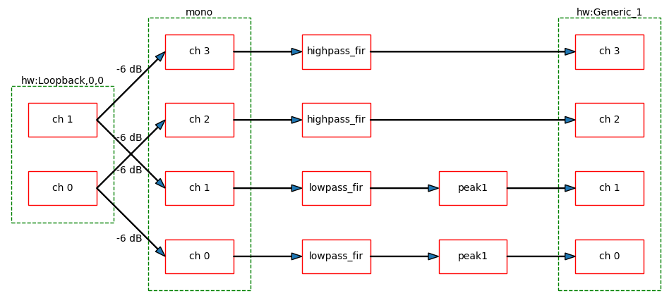

# CamillaDSP


A tool to create audio processing pipelines for applications such as active crossovers or room correction. It is written in Rust to benefit from the safety and elegant handling of threading that this language provides. 

Supported platforms: Linux, macOS, Windows.

Audio data is captured from a capture device and sent to a playback device. Alsa, PulseAudio, Wasapi and CoreAudio are currently supported for both capture and playback.

The processing pipeline consists of any number of filters and mixers. Mixers are used to route audio between channels and to change the number of channels in the stream. Filters can be both IIR and FIR. IIR filters are implemented as biquads, while FIR use convolution via FFT/IFFT. A filter can be applied to any number of channels. All processing is done in chunks of a fixed number of samples. A small number of samples gives a small in-out latency while a larger number is required for long FIR filters.
The full configuration is given in a yaml file.

### Table of Contents
**[Introduction](#introduction)**
- **[Background](#background)**
- **[How it works](#how-it-works)**
- **[System requirements](#system-requirements)**
- **[Usage example: crossover for 2-way speakers](#usage-example-crossover-for-2-way-speakers)**
- **[Dependencies](#dependencies)**
- **[Related projects](#related-projects)**

**[Installing](#installing)**

**[Building](#building)**
- **[Build with standard features](#building-in-linux-with-standard-features)**
- **[Customized build](#customized-build)**
- **[Optimize for your system](#optimize-for-your-system)**
- **[Building on Windows and macOS](#building-on-windows-and-macos)**

**[How to run](#how-to-run)**
- **[Command line options](#commandline-options)**
- **[Reloading the configuration](#reloading-the-configuration)**
- **[Controlling via websocket](#controlling-via-websocket)**

**[Capturing audio](#capturing-audio)**
- **[Alsa](#alsa)**
- **[PulseAudio](#pulseaudio)**
- **[Wasapi](#wasapi)**
- **[CoreAudio](#coreaudio)**
- **[Jack](#jack)**

**[Configuration](#configuration)**
- **[The YAML format](#the-yaml-format)**
- **[Devices](#devices)**
- **[Resampling](#resampling)**
- **[Mixers](#mixers)**
 - **[Filters](#filters)**
   - **[Gain](#gain)**
   - **[Volume](#volume)**
   - **[Loudness](#loudness)**
   - **[Delay](#delay)**
   - **[FIR](#fir)**
   - **[IIR](#iir)**
   - **[Dither](#dither)**
   - **[Difference equation](#difference-equation)**
- **[Pipeline](#pipeline)**
- **[Visualizing the config](#visualizing-the-config)**

**[Getting help](#getting-help)**
- **[FAQ](#faq)**
- **[Troubleshooting](#troubleshooting)**


# Introduction

## Background
The purpose of CamillaDSP is to enable audio processing with combinations of FIR and IIR filters. This functionality is available in EqualizerAPO, but for Windows only. For Linux the best known FIR filter engine is probably BruteFIR, which works very well but doesn't support IIR filters. 
The goal of CamillaDSP is to provide both FIR and IIR filtering for Linux, Windows and macOS, to be stable, fast and flexible, and be easy to use and configure.  

* BruteFIR: https://www.ludd.ltu.se/~torger/brutefir.html
* EqualizerAPO: https://sourceforge.net/projects/equalizerapo/
* The IIR filtering is heavily inspired by biquad-rs: https://github.com/korken89/biquad-rs 

## How it works
The audio pipeline in CamillaDSP runs in three separate threads. One thread handles capturing audio, one handles the playback, and one does the processing in between.
The capture thread passes audio to the processing thread via a message queue. Each message consists of a chunk of audio with a configurable size. The processing queue waits for audio messages, processes them in the order they arrive, and passes the processed audio via another message queue to the playback thread. There is also a supervisor thread for control.
This chart shows the most important parts:


### Capture
The capture thread reads a chunk samples from the audio device in the selected format. It then converts the samples to 64-bit floats (or optionally 32-bit). If resampling is enabled, the audio data is sent to the resampler. At the end, the chunk of samples is packed as a message that is then posted to the input queue of the processing thread. After this the capture thread returns to reading he next shunk of samples from the device.

### Processing
The processing thread waits for audio chunk messages to arrive in the input queue. Once a message arrives, it's passed through all the defined filters and mixers of the pipeline. Once all processing is done, the audio data is posted to the input queue of the playback device.

### Playback
The playback thread simply waits for audio messages to appear in the queue. Once a message arrives, the audio data is converted to the right sample format for the device, and written to the playback device. The Alsa playback device supports monitoring the buffer level of the playback device. This is used to send requests for adjusting the capture speed to the supervisor thread, on a separate message channel.

### Supervisor
The supervisor monitors all threads by listening to their status messages. The requests for capture rate adjust are passed on to the capture thread. It's also responsible for updating the configuration when requested to do so via the websocket server or a SIGHUP signal.

### Websocket server
The websocket server lauches a separate thread to handle each connected client. All commands to change the config are send to the supervisor thread.

## System requirements
CamillaDSP runs on Linux, macOS and Windows. The exact system requirements are determined by the amount of processing the application requires, but even relatively weak CPUs like Intel Atom have much more processing power than most will need.

In general, a 64-bit CPU and OS will perform better.

A few examples, done with CamillaDSP v0.5.0:

- A Raspberry Pi 4 doing FIR filtering of 8 channels, with 262k taps per channel, at 192 kHz. 
  CPU usage about 55%.

- An AMD Ryzen 7 2700u (laptop) doing FIR filtering of 96 channels, with 262k taps per channel, at 192 kHz. 
  CPU usage just under 100%.

### Linux
Both 64 and 32 bit architechtures are supported. All platforms supported by the Rustc compiler should work. 

Pre-built binaries are provided for:
- x86_64 (almost all PCs)
- armv7 (32-bit arm, for example a Raspeberry Pi 2,3,4 with a 32-bit OS)
- aarch64 (64-bit arm, for example Raspberry Pis running a 64 bit OS) 

### Windows
An x86_64 CPU and the 64-bit version of Windows is recommended. Any x86_64 CPU will likely be sufficient.

Pre-built binaries are provided for 64-bit systems.

### MacOS
CamillaDSP can run on both Intel and Apple Silicon macs. Any reasonably recent version of MacOS should work.

Pre-built binaries are provided for both Intel and Apple Silicon


## Usage example: crossover for 2-way speakers
A crossover must filter all sound being played on the system. This is possible with both PulseAudio and Alsa by setting up a loopback device (Alsa) or null sink (Pulse) and setting this device as the default output device. CamillaDSP is then configured to capture from the output of this device and play the processed audio on the real sound card.

See the [tutorial for a step-by-step guide.](./stepbystep.md)

## Dependencies
These are the key dependencies for CamillDSP.
* https://crates.io/crates/alsa - Alsa audio backend
* https://crates.io/crates/clap - Command line argument parsing
* https://crates.io/crates/cpal - Wasapi and CoreAudio audio backends
* https://crates.io/crates/libpulse-simple-binding - PulseAudio audio backend 
* https://crates.io/crates/realfft - Wrapper for RustFFT that speeds up FFTs of real-valued data
* https://crates.io/crates/rustfft - FFT used for FIR filters
* https://crates.io/crates/rubato - Sample rate conversion
* https://crates.io/crates/serde_yaml - Config file reading
* https://crates.io/crates/tungstenite - Websocket server


## Related projects
These are part of the CamillaDSP family:
* https://github.com/HEnquist/pycamilladsp - Python library for communicating with CamillaDSP over websocket
* https://github.com/HEnquist/pycamilladsp-plot - Plotting and visualization of configurations
* https://github.com/HEnquist/camillagui-backend - Server for a web-based gui for CamillaDSP
* https://github.com/HEnquist/camilladsp-config - Example configurations for things like running CamillaDSP as a systemd service

Other projects meant to be used with CamillaDSP:
* https://github.com/scripple/alsa_cdsp - ALSA CamillaDSP "I/O" plugin, automatic config updates at changes of samplerate, sample format or number of channels
* https://github.com/Lykkedk/SuperPlayer_v2.0 - Automatic filter switching at sample rate change for squeezelite

Projects of general nature which can be useful together with CamillaDSP:
* https://github.com/scripple/alsa_hook_hwparams - Alsa hooks for reacting to sample rate and format changes
* https://github.com/HEnquist/cpal-listdevices - List audio devices with names and supported formats under Windows and macOS. 


# Installing

The easiest way to install CamillaDSP is to download a pre-built binary. Binaries for each release are available for the most common systems. See the ["Releases"](https://github.com/HEnquist/camilladsp/releases) page. To see the files click "Assets".

These are compressed files containing a single executable file that is ready to run. 

The following configurations are provided:
| Filename | Description | Backends |
|----------|-------------|----------|
| `camilladsp-linux-amd64.tar.gz` | Linux on 64-bit Intel or AMD CPU | Alsa, Pulseaudio |
| `camilladsp-linux-armv7.tar.gz` | Linux on Armv7 with Neon, intended for Raspberry Pi 2 and up but should also work on others | Alsa |
| `camilladsp-macos-amd64.tar.gz` | macOS on 64-bit Intel CPU | CoreAudio |
| `camilladsp-windows-amd64.zip` | Windows on 64-bit Intel or AMD CPU | Wasapi |

All builds include the Websocket server.

The `.tar.gz`-files can be uncompressed with the `tar` comand: 

```sh 
tar -xvf camilladsp-linux-amd64.tar.gz
```


# Building

Use recent stable versions of rustc and cargo. The minimum rustc version is 1.43.0. 

The recommended way to install rustc and cargo is by using the "rustup" tool. This tool works on all supported platforms (Linux, macOS and Windows). Get it here: https://rustup.rs/

For Windows you also need the "Build Tools for Visual Studio". Get them from here: https://aka.ms/buildtools

By default both the Alsa and PulseAudio backends are enabled, but they can be disabled if desired. That also removes the need for the the corresponding system Alsa/Pulse packages.

By default the internal processing is done using 64-bit floats. There is a possibility to switch this to 32-bit floats. This might be useful for speeding up the processing when running on a 32-bit CPU (or a 64-bit CPU running in 32-bit mode), but the actual speed advantage has not been evaluated. Note that the reduction in precision increases the numerical noise.

CamillaDSP includes a Websocket server that can be used to pass commands to the running process. This feature is enabled by default, but can be left out. The feature name is "websocket". For usage see the section "Controlling via websocket".

The default FFT library is RustFFT, but it's also possible to use FFTW. This is enabled by the feature "FFTW". When the chunksize is a power of two, like 1024 or 4096, FFTW is only a few percent faster than RustFFT. The difference gets much larger if the chunksize is a "strange" number, like a large prime. FFTW is a much larger and more complicated library, so using FFTW is only recommended if you for some reason can't use an "easy" chunksize and this makes RustFFT much slower.

## Building in Linux with standard features
- Install pkg-config (very likely already installed):
- - Fedora: ```sudo dnf install pkgconf-pkg-config```
- - Debian/Ubuntu etc: ```sudo apt-get install pkg-config```
- - Arch: ```sudo pacman -S cargo pkg-config```
- Install Alsa dependency:
- - Fedora: ```sudo dnf install alsa-lib-devel```
- - Debian/Ubuntu etc: ```sudo apt-get install libasound2-dev```
- - Arch: ```sudo pacman -S alsa-lib```
- Install Pulse dependency:
- - Fedora: ```sudo dnf install pulseaudio-libs-devel```
- - Debian/Ubuntu etc: ```sudo apt-get install libpulse-dev```
- - Arch:  ```sudo pacman -S libpulse```
- Install OpenSSL dependency:
- - Fedora: ```sudo dnf install openssl openssl-devel```
- - Debian/Ubuntu etc: ```sudo apt-get install openssl libssl-dev```
- - Arch:  ```sudo pacman -S openssl```
- Clone the repository
- Build with standard options: ```cargo build --release```
- - see below for other options
- The binary is now available at ./target/release/camilladsp
- Optionally install with `cargo install --path .`
- - Note: the `install` command takes the same options for features as the `build` command. 

## Customized build
All the available options, or "features" are:
- `alsa-backend`: Alsa support
- `pulse-backend`: PulseAudio support
- `cpal-backend`: Wasapi and CoreAudio support
- `jack-backend`: Jack support. This also enables the cpal-backend feature if building on Windows or macOS.
- `websocket`: Websocket server for control
- `secure-websocket`: Enable secure websocket, also enables the `websocket` feature
- `FFTW`: Use FFTW instead of RustFFT
- `32bit`: Perform all calculations with 32-bit floats (instead of 64)
- `neon`: Enable the experimental Neon support for aarch64 in the resampler. Note that this only works on 64-bit arm, and requires a very recent nightly rust compiler.

The first three (`alsa-backend`, `pulse-packend`, `websocket`) are included in the default features, meaning if you don't specify anything you will get those three.
Cargo doesn't allow disabling a single default feature, but you can disable the whole group with the `--no-default-features` flag. Then you have to manually add all the ones you want.

The `jack-backend` feature requires jack and its development files to be installed. To install:
- Fedora: ```sudo dnf install jack-audio-connection-kit jack-audio-connection-kit-devel```
- Debian/Ubuntu etc: ```sudo apt-get install jack libjack-dev```
- Arch:  ```sudo pacman -S jack```

Example 1: You want `alsa-backend`, `pulse-backend`, `websocket` and `FFTW`. The first three are included by default so you only need to add `FFTW`:
```
cargo build --release --features FFTW
(or)
cargo install --path . --features FFTW
```

Example 2: You want `alsa-backend`, `websocket`, `32bit` and `FFTW`. Since you don't want `pulse-backend` you have to disable the defaults, and then add both `alsa-backend` and `websocket`:
```
cargo build --release --no-default-features --features alsa-backend --features websocket --features FFTW --features 32bit
(or)
cargo install --path . --no-default-features --features alsa-backend --features websocket --features FFTW --features 32bit
```

## Optimize for your system
By default Cargo builds for a generic system, meaning the resulting binary might not run as fast as possible on your system.
This means for example that it will not use AVX on an x86-64 CPU, or NEON on a Raspberry Pi.

To make an optimized build for your system, you can specify this in your Cargo configuration file. 
Or, just set the RUSTFLAGS environment variable by adding RUSTFLAGS='...' in from of the "cargo build" or "cargo install" command.

Make an optimized build on x86-64:
```
RUSTFLAGS='-C target-cpu=native' cargo build --release
```

On a Raspberry Pi also state that NEON should be enabled:
```
RUSTFLAGS='-C target-feature=+neon -C target-cpu=native' cargo build --release 
```

## Building on Windows and macOS
The Alsa and Pulse backends should not be included when building on Windows and macOS. The recommended build command is:

macOS:
```
RUSTFLAGS='-C target-cpu=native' cargo build --release  --no-default-features --features cpal-backend --features websocket
```

Windows (cmd.exe command prompt):
```
set RUSTFLAGS=-C target-cpu=native 
cargo build --release  --no-default-features --features cpal-backend --features websocket
```

Windows (PowerShell):
```
$env:RUSTFLAGS="-C target-cpu=native"
cargo build --release  --no-default-features --features cpal-backend --features websocket
```

On macOS both the PulseAudio and FFTW features can be used. The necessary dependencies can be installed with brew:
```
brew install fftw
brew install pkg-config
brew install pulseaudio
```

The FFTW feature can also be used on Windows. There is no need to install anything extra.


# How to run

The command is simply:
```
camilladsp /path/to/config.yml
```
This starts the processing defined in the specified config file. The config is first parsed and checked for errors. This first checks that the YAML syntax is correct, and then checks that the configuration is complete and valid. When an error is found it displays an error message describing the problem. See more about the configuration file below.

## Command line options
Starting with the --help flag prints a short help message:
```
> camilladsp --help
CamillaDSP 0.5.0
Henrik Enquist <henrik.enquist@gmail.com>
A flexible tool for processing audio

Built with features: alsa-backend, pulse-backend, websocket

USAGE:
    camilladsp [FLAGS] [OPTIONS] <configfile>

FLAGS:
    -c, --check      Check config file and exit
    -h, --help       Prints help information
    -V, --version    Prints version information
    -v               Increase message verbosity
    -w, --wait       Wait for config from websocket

OPTIONS:
    -o, --logfile <logfile>                Write logs to file
    -l, --loglevel <loglevel>              Set log level [possible values: trace, debug, info, warn, error, off]
    -a, --address <address>                IP address to bind websocket server to
    -g, --gain <gain>                      Set initial gain in dB for Volume filters
    -p, --port <port>                      Port for websocket server
    -n, --channels <channels>              Override number of channels of capture device in config
    -e, --extra_samples <extra_samples>    Override number of extra samples in config
    -r, --samplerate <samplerate>          Override samplerate in config
    -f, --format <format>                  Override sample format of capture device in config [possible values: S16LE,
                                           S24LE, S24LE3, S32LE, FLOAT32LE, FLOAT64LE]

ARGS:
    <configfile>    The configuration file to use
```
If the "check" flag is given, the program will exit after checking the configuration file. Use this if you only want to verify that the configuration is ok, and not start any processing.

To enable the websocket server, provide a port number with the `-p` option. Leave it out, or give 0 to disable. 

By default the websocket server binds to the address 127.0.0.1 which means it's only accessible locally. If it should be also available to remote machines, give the IP address of the interface where it should be available with the `-a` option. Giving 0.0.0.0 will bind to all interfaces. The `--cert` and `--pass` options are used to provide an identity that is used to enable secure websocket connections. See the [websocket readme for more details.](./websocket.md)

If the "wait" flag, `-w` is given, CamillaDSP will start the websocket server and wait for a configuration to be uploaded. Then the config file argument must be left out.

The default logging setting prints messages of levels "error", "warn" and "info". This can be changed with the `loglevel` option. Setting this to for example `warn` will print messages of level `warn` and above, but suppress the lower levels of `info`, `debug` and `trace`. Alternatively, the log level can be changed with the verbosity flag. By passing the verbosity flag once, `-v`, `debug` messages are enabled. If it's given twice, `-vv`, it also prints `trace` messages.

The log messages are normally written to the terminal via stderr, but they can instead be written to a file by giving the `logfile` option. The argument should be the path to the logfile. If this file is not writable, CamillaDSP will panic and exit. 

There are a few options to override values in the loaded config file. Giving these options means the provided values will be used instead of the values in any loaded configuration. To change the values, CamillaDSP has to be restarted. If the config file has resampling disabled, then overriding the samplerate will change the `samplerate` parameter. But if resampling is enabled, it will instead change the `capture_samplerate` parameter. If then `enable_rate_adjust` is false and `capture_samplerate`=`samplerate`, then resampling will be disabled. When overriding the samplerate, two other parameters are scaled as well. Firstly, the `chunksize` is multiplied or divided by integer factors to try to keep the pipeline running at a constant number of chunks per second. Secondly, the value of `extra_samples` is scaled to give the extra samples the same duration at the new samplerate. But if the `extra_samples` override is used, the given value is used without scaling it. 

The `--gain` option can accept negative values, but this requires a little care since the minus sign can be misinterpreted as another option. 
It works as long as there is no space in front of the minus sign.

These work (for a gain of +/- 12.3 dB):
```
-g12.3
-g 12.3
--gain 12.3
--gain=12.3

-g-12.3
--gain=-12.3
```

These will __NOT__ work:
```
-g -12.3
--gain -12.3
``` 


## Exit codes
These are the exit codes CamillaDSP will give:
| Exit code | Meaning |
| --------- | ------- |
| 0         | Normal exit, no error |
| 101       | Invalid config file, see the error message for details |
| 102       | Error from DSP process, see the error message for details |


## Reloading the configuration
The configuration can be reloaded without restarting by sending a SIGHUP to the camilladsp process. This will reload the config and if possible apply the new settings without interrupting the processing. Note that for this to update the coefficients for a FIR filter, the filename of the coefficients file needs to change.

## Controlling via websocket
See the [separate readme for the websocket server](./websocket.md)


# Capturing audio
In order to insert CamillaDSP between applications and the sound card, a virtual sound card can be used. This works with Alsa, PulseAudio, CoreAudio and Wasapi. It is also possible to use pipes for apps that support outputting the audio data to stdout. 

## Alsa
An Alsa Loopback device can be used. This device behaves like a sound card with two devices playback and capture. The sound being send to the playback side on one device can then be captured from the capture side on the other device. To load the kernel device type:
```
sudo modprobe snd-aloop
```
Find the name of the device:
```
aplay -l
```

Play a track on card 2, device 1, subdevice 0 (the audio can then be captured from card 2, device 0, subdevice 0):
```
aplay -D hw:2,1,0 sometrack.wav
```

## PulseAudio
PulseAudio provides a null-sink that can be used to capture audio from applications. To create a null sink type:
```
pacmd load-module module-null-sink sink_name=MySink
```
This device can be set as the default output, meaning any application using PulseAudio will use it. The audio sent to this device can then be captured from the monitor output named MySink.monitor.
All available sinks and sources can be listed with the commands:
```
pacmd list-sinks
pacmd list-sources
```

## Wasapi
To capture audio from applications a virtual sound card is needed. [VB-CABLE from VB-AUDIO](https://www.vb-audio.com/Cable/) works well.

Set VB-CABLE as the default playback device in the control panel, and let CamillaDSP capture from the VB-CABLE output.

The device name is the same as seen in the Windows volume control. For example, the VB-CABLE device name is "CABLE Output (VB-Audio Virtual Cable)". The device name is built from the input/output name and card name, and the format is "{input/output name} ({card name})".

The sample format is always 32-bit float (FLOAT32LE) even if the device is configured to use another format.

The sample rate must match the default format of the device. To change this, open "Sound" in the Control panel, select the sound card, and click "Properties". Then open the "Advanced" tab and select the desired format under "Default Format".


## CoreAudio
To capture audio from applications a virtual sound card is needed. This has been verified to work well with [Soundflower](https://github.com/mattingalls/Soundflower)

Set the virtual sound card as the default playback device in the Sound preferences, and let CamillaDSP capture from the output of this card.

The device name is the same as the one shown in the "Audio MIDI Setup" that can be found under "Other" in Launchpad. The name for the 2-channel interface of Soundflower is "Soundflower (2ch)", and the built in audio in a MacBook Pro is called "Built-in Output".

The sample format is always 32-bit float (FLOAT32LE) even if the device is configured to use another format.

## Jack
The jack server must be running. 

Set `device` to "default" for both capture and playback. The sample format is fixed at 32-bit float (FLOAT32LE).

The samplerate must match the samplerate configured for the Jack server. 

CamillaDSP will show up in Jack as "cpal_client_in" and "cpal_client_out".

# Configuration

## The YAML format
CamillaDSP is using the YAML format for the configuration file. This is a standard format that was chosen because of its nice readable syntax. The Serde library is used for reading the configuration. 
There are a few things to keep in mind with YAML. The configuration is a tree, and the level is determined by the indentation level. For YAML the indentation is as important as opening and closing brackets in other formats. If it's wrong, Serde might not be able to give a good description of what the error is, only that the file is invalid. 
If you get strange errors, first check that the indentation is correct. Also check that you only use spaces and no tabs. Many text editors can help by highlighting syntax errors in the file. 

## Devices
Example config (note that parameters marked (*) can be left out to use their default values):
```
devices:
  samplerate: 96000
  chunksize: 1024
  queuelimit: 4 (*)
  silence_threshold: -60 (*)
  silence_timeout: 3.0 (*)
  target_level: 500 (*)
  adjust_period: 10 (*)
  enable_rate_adjust: true (*)
  enable_resampling: true (*)
  resampler_type: BalancedAsync (*)
  capture_samplerate: 44100 (*)
  capture:
    type: Pulse
    channels: 2
    device: "MySink.monitor"
    format: S16LE
  playback:
    type: Alsa
    channels: 2
    device: "hw:Generic_1"
    format: S32LE
```
* `samplerate`

  The `samplerate` setting decides the sample rate that everything will run at. 
  This rate must be supported by both the capture and  playback device.

* `chunksize`

  All processing is done in chunks of data. The `chunksize` is the number of samples each chunk will have per channel. 
  It's good if the number is an "easy" number like a power of two, since this speeds up the FFT in the Convolution filter. 
  Suggested starting points for different sample rates:
  - 44.1 or 48 kHz: 1024
  - 88.2 or 96 kHz: 2048
  - 176.4 or 192 kHz: 4096

  The duration in seconds of a chunk is `chunksize/samplerate`, so the suggested values corresponds to about 22 ms per chunk. This is a resonable value, and making it shorter can increase the cpu usage and make buffer underruns more likely.

  If you have long FIR filters you can reduce CPU usage by making the chunksize larger. 
  When increasing, try increasing in factors of two, like 1024 -> 2048 or 4096 -> 8192. 
  

* `queuelimit` (optional, defaults to 4)

  The field `queuelimit` should normally be left out to use the default of 4. 
  It sets the limit for the length of the queues between the capture device and the processing thread, 
  and between the processing thread and the playback device. 
  The total queue size limit will be `2*chunksize*queuelimit` samples per channel. 
  The maximum RAM usage is `8*2*chunksize*queuelimit` bytes. 
  For example at the default setting of 128 and a chunksize of 1024, the total size limit of the queues 
  is about 2MB (or 1MB if the 32bit compile option is used). 
  The queues are allocated as needed, this value only sets an upper limit. 

  The value should only be changed if the capture device can provide data faster 
  than the playback device can play it, like when using the Alsa "cdsp" plugin.
  If this case, set `queuelimit` to a low value like 1.

* `enable_rate_adjust` (optional, defaults to false)

  This enables the playback device to control the rate of the capture device, 
  in order to avoid buffer underruns of a slowly increasing latency. This is currently supported when using an Alsa, Wasapi or CoreAudio playback device.
  Setting the rate can be done in two ways.
  * If the capture device is an Alsa Loopback device, the adjustment is done by tuning the virtual sample clock of the Loopback device. This avoids any need for resampling.
  * If resampling is enabled, the adjustment is done by tuning the resampling ratio. The `resampler_type` must then be one of the "Async" variants.
  

* `target_level` (optional, defaults to the `chunksize` value)

  The value is the number of samples that should be left in the buffer of the playback device
  when the next chunk arrives. Only applies when `enable_rate_adjust` is set to `true`.
  It will take some experimentation to find the right number. 
  If it's too small there will be buffer underruns from time to time, 
  and making it too large might lead to a longer input-output delay than what is acceptable. 
  Suitable values are in the range 1/2 to 1 times the `chunksize`. 
  
* `adjust_period` (optional, defaults to 10)
  
  The `adjust_period` parameter is used to set the interval between corrections, in seconds. 
  The default is 10 seconds. Only applies when `enable_rate_adjust` is set to `true`.

* `silence_threshold` & `silence_timeout` (optional)
  The fields `silence_threshold` and `silence_timeout` are optional 
  and used to pause processing if the input is silent. 
  The threshold is the threshold level in dB, and the level is calculated as the difference 
  between the minimum and maximum sample values for all channels in the capture buffer. 
  0 dB is full level. Some experimentation might be needed to find the right threshold.

  The `silence_timeout` (in seconds) is for how long the signal should be silent before pausing processing. 
  Set this to zero, or leave it out, to never pause.

* `enable_resampling` (optional, defaults to false)

  Set this to `true` to enable resampling of the input signal. 
  In addition to resampling the input to a different sample rate, 
  this can be useful for rate-matching capture and playback devices with independant clocks.

* `resampler_type` (optional, defaults to "BalancedAsync")

  The resampler type to use. Valid choices are "Synchronous", "FastAsync", "BalancedAsync", "AccurateAsync", "FreeAsync".

  If used for rate matching with `enable_rate_adjust: true` the one of the "Async" variants must be used. 
  See also the [Resampling section.](#resampling) 

* `capture_samplerate` (optional, defaults to value of `samplerate`)

  The capture samplerate. If the resampler is only used for rate-matching then the capture samplerate 
  is the same as the overall samplerate, and this setting can be left out.

 
* `capture` and `playback`
  See first the [separate help on how to find the device names and parameters.](./devices.md)
  Input and output devices are defined in the same way. 
  A device needs:
  * `type`: 
    The available types depend on which features that were included when compiling. All possible types are:
    * `Alsa` 
    * `Pulse`
    * `Wasapi`
    * `CoreAudio`
    * `Jack`
    * `File`
    * `Stdin` (capture only)
    * `Stdout` (playback only)
  * `channels`: number of channels
  * `device`: device name (for Alsa, Pulse, Wasapi, CoreAudio). For CoreAudio and Wasapi, "default" will give the default device.
  * `filename` path the the file (for File)
  * `format`: sample format (for all except Jack).

    Currently supported sample formats are signed little-endian integers of 16, 24 and 32 bits as well as floats of 32 and 64 bits:
    * S16LE - Signed 16-bit int, stored as two bytes
    * S24LE - Signed 24-bit int, stored as four bytes (three bytes of data, one padding byte)
    * S24LE3 - Signed 24-bit int, stored as three bytes (with no padding)
    * S32LE - Signed 32-bit int, stored as four bytes 
    * FLOAT32LE - 32-bit float, stored as four bytes
    * FLOAT64LE - 64-bit float, stored as eight bytes

    __Note that there are two 24-bit formats! Make sure to select the correct one.__

    Supported formats:
    |            | Alsa               | Pulse              | Wasapi             | CoreAudio          | Jack               | File/Stdin/Stdout  |
    |------------|--------------------|--------------------|--------------------|--------------------|--------------------|--------------------|
    | S16LE      | :heavy_check_mark: | :heavy_check_mark: | :heavy_check_mark: | :heavy_check_mark: | :x:                | :heavy_check_mark: |
    | S24LE      | :heavy_check_mark: | :heavy_check_mark: | :x:                | :x:                | :x:                | :heavy_check_mark: |
    | S24LE3     | :heavy_check_mark: | :heavy_check_mark: | :x:                | :x:                | :x:                | :heavy_check_mark: |
    | S32LE      | :heavy_check_mark: | :heavy_check_mark: | :x:                | :x:                | :x:                | :heavy_check_mark: |
    | FLOAT32LE  | :heavy_check_mark: | :heavy_check_mark: | :heavy_check_mark: | :heavy_check_mark: | :heavy_check_mark: | :heavy_check_mark: |
    | FLOAT64LE  | :heavy_check_mark: | :x:                | :x:                | :x:                | :x:                | :heavy_check_mark: |
  
  
    Equivalent formats (for reference):
    | CamillaDSP | Alsa       | Pulse     |
    |------------|------------|-----------|
    | S16LE      | S16_LE     | S16LE     |
    | S24LE      | S24_LE     | S24_32LE  |
    | S24LE3     | S24_3LE    | S24LE     |
    | S32LE      | S32_LE     | S32LE     |
    | FLOAT32LE  | FLOAT_LE   | FLOAT32LE |
    | FLOAT64LE  | FLOAT64_LE | -         |
  
    The __File__ device type reads or writes to a file, while __Stdin__ reads from stdin and __Stdout__ writes to stdout.
    The format is raw interleaved samples, in the selected sample format.
    If the capture device reaches the end of a file, the program will exit once all chunks have been played. 
    That delayed sound that would end up in a later chunk will be cut off. To avoid this, set the optional parameter `extra_samples` for the File capture device.
    This causes the capture device to yield the given number of samples (per channel) after reaching end of file, allowing any delayed sound to be played back.
    The __Stdin__ capture device and __Stdout__ playback device use stdin and stdout, so it's possible to easily pipe audio between applications:
    ```
    > camilladsp stdio_capt.yml > rawfile.dat
    > cat rawfile.dat | camilladsp stdio_pb.yml
    ```
    Note: On Unix-like systems it's also possible to use the File device and set the filename to `/dev/stdin` for capture, or `/dev/stdout` for playback. 

    Please note the __File__ capture device isn't able to read wav-files directly. If you want to let CamillaDSP play wav-files, please see the [separate guide for converting wav to raw files](coefficients_from_wav.md).

  The __Alsa__ capture device has two optional extra properties that are used to work around quirks of some devices. 
  Both should normally be left out, or set to the default value of `false`.
  - `retry_on_error`: Set this to `true` if capturing from the USB gadget driver on for example a Raspberry Pi. 
    This device stops providing data if playback is stopped or paused, and retrying capture after an error 
    allows capture to continue when more data becomes available.
  - `avoid_blocking_read`: Some devices misbehave when using the blocking IO of Alsa, 
    typically when there is no incoming data. Examples are spdif inputs when there is no signal present, 
    or the USB gadget driver when the source isn't sending any data. 
    Set this to `true` if you get capture errors when stopping the signal. This then allows processing to continue once the signal returns. 

  The __File__ and __Stdin__ capture devices support two additional optional parameters, for advanced handling of raw files and testing:
  * `skip_bytes`: Number of bytes to skip at the beginning of the file or stream. This can be used to skip over the header of some formats like .wav (which typically has a fixed size 44-byte header). Leaving it out or setting to zero means no bytes are skipped. 
  * `read_bytes`: Read only up until the specified number of bytes. Leave it out to read until the end of the file or stream.

  * Example, this will skip the first 50 bytes of the file (index 0-49) and then read the following 200 bytes (index 50-249).
    ```
    skip_bytes: 50
    read_bytes: 200
    ```
    
  The __Jack__ capture and playback devices do not have a `format` parameter, since they always uses the FLOAT32LE format. It seems that the `device` property should always be set to "default". This parameter may be removed in a future version.


## Resampling

Resampling is provided by the [Rubato library.](https://github.com/HEnquist/rubato)

This library does asynchronous and synchronous resampling with adjustable parameters. 
For asynchronous resampling, the overall strategy is to use a sinc interpolation filter with a fixed oversampling ratio, 
and then use polynomial interpolation to get values for arbitrary times between those fixed points.
For synchronous resampling it instead works by transforming the waveform with FFT, modifying the spectrum, and then 
getting the resampled waveform by inverse FFT.

CamillaDSP provides four preset profiles for the resampler:
* Synchronous
* FastAsync
* BalancedAsync
* AccurateAsync

The "BalancedAsync" preset is the best choice in most cases, if an asynchronous resampler is needed. 
It provides good resampling quality with a noise threshold in the range 
of -150 dB along with reasonable CPU usage. 
As -150 dB is way beyond the resolution limit of even the best commercial DACs, 
this preset is thus sufficient for all audio use.
The "FastAsync" preset is faster but have a little more high-frequency roll-off 
and give a bit higher resampling artefacts. 
The "AccurateAsync" preset provide the highest quality result, 
with all resampling artefacts below -200dB, at the expense of higher CPU usage.
There is also a "FreeAsync" mode as well where all parameters can be set freely. The configuration is specified like this:
```
...
  resampler_type:
    FreeAsync:
      f_cutoff: 0.9
      sinc_len: 128
      window: Hann2
      oversampling_ratio: 128
      interpolation: Cubic
```

For reference, the asynchronous presets are defined according to this table:
|                   | FastAsync | BalancedAsync | AccurateAsync |
|-------------------|-----------|---------------|---------------|
|sinc_len           | 64        | 128           | 256           |
|oversampling_ratio | 1024      | 1024          | 256           |
|interpolation      | Linear    | Linear        | Cubic         |
|window             | Hann2     | Blackman2     | BlackmanHarris2 |
|f_cutoff           | 0.915     | 0.925         | 0.947           |


For performing fixed ratio resampling, like resampling 
from 44.1kHz to 96kHz (which corresponds to a precise ratio of 147/320)
choose the "Synchronous" variant. 
This is considerably faster than the asynchronous variants, but does not support rate adjust.
The quality is comparable to the "AccurateAsync" preset.

When using the rate adjust feature to match capture and playback devices, 
one of the "Async" variants must be used. 
These asynchronous presets do not rely on a fixed resampling ratio.
When rate adjust is enabled the resampling ratio is dynamically adjusted in order to compensate 
for drifts and mismatches between the input and output sample clocks.  
Using the "Synchronous" variant with rate adjust enabled will print warnings, 
and any rate adjust request will be ignored.

See the library documentation for more details. [Rubato on docs.rs](https://docs.rs/rubato/0.1.0/rubato/)


## Mixers
A mixer is used to route audio between channels, and to increase or decrease the number of channels in the pipeline.
Example for a mixer that copies two channels into four:
```
mixers:
  ExampleMixer:
    channels:
      in: 2
      out: 4
    mapping:
      - dest: 0
        mute: false (*)
        sources:
          - channel: 0
            gain: 0
            inverted: false
      - dest: 1
        mute: false (*)
        sources:
          - channel: 1
            gain: 0
            inverted: false
      - dest: 2
        sources:
          - channel: 0
            gain: 0
            inverted: false
      - dest: 3
        sources:
          - channel: 1
            gain: 0
            inverted: false
```
Parameters marked with (*) are optional. 
The "channels" group define the number of input and output channels for the mixer. The mapping section then decides how to route the audio.
This is a list of the output channels, and for each channel there is a "sources" list that gives the sources for this particular channel. Each source has a `channel` number, a `gain` value in dB, and if it should be `inverted` (true/false). A channel that has no sources will be filled with silence. The `mute` option determines if an output channel of the mixer should be muted. This parameter is optional, and defaults to not muted.
Another example, a simple stereo to mono mixer:
```
mixers:
  mono:
    channels:
      in: 2
      out: 1
    mapping:
      - dest: 0
        sources:
          - channel: 0
            gain: -6
            inverted: false
          - channel: 1
            gain: -6
            inverted: false
```

### Skip processing of unused channels
Some audio interfaces bundle all their inputs togehter, meaning that it might be necessary to capture a large number of channels to get access to a particular input.
To reduce the CPU load, CamillaDSP will try to avoid processing of any channel that is captured but not used in the pipeline.

Let's say we have an interface with one analog input, and one SPDIF. These are presented as a single 4-channel input where channels 0 and 1 are analog, 2 and 3 SPDIF. Then, setting the number of capture channels to 4 will enable both inputs. In this case we are only interested in the SPDIF input. This is then done by adding a mixer that reduces the number of channels to 2. In this mixer, input channels 0 and 1 are not mapped to anything. This is then detected, and no format conversion, resampling or processing will be done on these two channels.  

## Filters
The filters section defines the filter configurations to use in the pipeline. It's enough to define each filter once even if it should be applied on several channels.
The supported filter types are Biquad, BiquadCombo and DiffEq for IIR and Conv for FIR. There are also filters just providing gain and delay. The last filter type is Dither, which is used to add dither when quantizing the output.

### Gain
The gain filter simply changes the amplitude of the signal. The `inverted` parameter simply inverts the signal. This parameter is optional and the default is to not invert. The `gain` value is given in dB, and a positive value means the signal will be amplified while a negative values attenuates. The gain value must be in the range -150 to +150 dB. The `mute` parameter determines if the the signal should be muted. This is optional and defaults to not mute.

Example Gain filter:
```
filters:
  gainexample:
    type: Gain
    parameters:
      gain: -6.0 
      inverted: false
      mute: false (*)
```

### Volume
The Volume filter is intended to be used as a volume control. The inital volume and muting state can be set with the `gain` and `mute` command line parameters. The volume can then be changed via the websocket. A request to set the volume will be applied to all Volume filters. When the volume or mute state is changed, the gain is ramped smoothly to the new value. The duration of this ramp is set by the `ramp_time` parameter (unit milliseconds). The value must not be negative. If left out, it defaults to 200 ms. The value will be rounded to the nearest number of chunks. To use this filter, insert a Volume filter somewhere in the pipeline for each channel. It's possible to use this to make a dithered volume control by placing the Volume filter somewhere in the pipeline, and having a Dither filter as the last step.

Example Volume filter:
```
filters:
  volumeexample:
    type: Volume
    parameters:
      ramp_time: 200
```

### Loudness
The Loudness filter is intended to be used as a volume control, similarly to the Volume filter. See the Volume filter for a description of how it is used.
The difference is that the Loudness filter applies loudness correction when the volume is lowered. The method is the same as the one implemented by the [RME ADI-2 DAC FS](https://www.rme-audio.de/adi-2-dac.html). The loudness correction is done as shelving filters that boost the high (above 3500 Hz) and low (below 70 Hz) frequencies. The amount of boost is adjustable with the `high_boost` and `low_boost` parameters. If left out, they default to 10 dB.
- When the volume is above the `reference_level`, only gain is applied.
- When the volume is below `reference_level` - 20, the full correction is applied.
- In the range between `reference_level` and `reference_level`-20, the boost value is scaled linearly.


In this figure, the `reference_level` was set to -5 dB, and `high_boost` = `low_boost` = 10 dB. At a gain of 0 and -5, the curve is flat. Below that the boost increases. At -15 dB half of the boost, and at -25 the full boost is applied. Below -25 dB, the boost value stays constant.

Example Loudness filter:
```
filters:
  loudnessvol:
    type: Loudness
    parameters:
      ramp_time: 200.0
      reference_level: -25.0 
      high_boost: 7.0
      low_boost: 7.0
```
Allowed ranges:
- reference_level: -100 to 0
- high_boost: 0 to 20
- low_boost: 0 to 20

### Delay
The delay filter provides a delay in milliseconds or samples. The `unit` can be `ms` or `samples`, and if left out it defaults to `ms`. If the `subsample` parameter is set to `true`, then it will use use an IIR filter to achieve subsample delay precision. If set to `false`, the value will instead be rounded to the nearest number of full samples. This is a little faster and should be used if subsample precision is not required. 

The delay value must be positive or zero. 

Example Delay filter:
```
filters:
  delayexample:
    type: Delay
    parameters:
      delay: 12.3
      unit: ms
      subsample: false
```

### FIR
A FIR filter is given by an impulse response provided as a list of coefficients. The coefficients are preferably given in a separate file, but can be included directly in the config file. If the number of coefficients (or taps) is larger than the chunksize setting it will use segmented convolution. The number of segments is the filter length divided by the chunksize, rounded up.

Example FIR filters:
```
filters:
  example_fir_a:
    type: Conv
    parameters:
      type: Raw 
      filename: path/to/filter.txt
      format: TEXT
      skip_bytes_lines: 0 (*)
      read_bytes_lines: 0 (*)
  example_fir_b:
    type: Conv
    parameters:
      type: Wav 
      filename: path/to/filter.txt
      channel: 0 (*)
```
The `type` can be `Raw`, `Wav` or `Values`. Use `Wav` to load a standard .wav file, `Raw` to load a raw file (see list of allowed raw formats below), and `Values` for giving the coefficients directly in the configuration file. The `filename` field should hold the path to the coefficient file. Using the absolute path is recommended in most cases.

If a relative path is given it will first try to find the file relative to the config file path. If it's not found there, the path is assumed to be relative to the current working directory. Note that this only applies when the config is loaded from a file. When a config is supplied via the websocket server only the current working dir of the CamillaDSP process will be searched.

If the filename includes the tokens `$samplerate$` or `$channels$`, these will be replaced by the corresponding values from the config. For example, if samplerate is 44100, the filename `/path/to/filter_$samplerate$.raw` will be updated to `/path/to/filter_44100.raw`. 

#### Values directly in config file

Example for giving values:
```
filters:
  lowpass_fir:
    type: Conv
    parameters:
      type: Values
      values: [0.0, 0.1, 0.2, 0.3]
      length: 12345
```
The `length` setting is optional. It is used to extend the number of coefficients past the ones given in `values`. The added coefficients are all zeroes. This is intended to provide an easy way to evaluating the CPU load for different filter lengths.

For testing purposes the entire "parameters" block can be left out (or commented out with a # at the start of each line). This then becomes a dummy filter that does not affect the signal.

#### Coefficients from Wav-file

Supplying the coefficients as `.wav` file is the most conveient method.
The `Wav` type takes only one parameter `channel`. This is used to select which channel of a multi-channel file to load. For a standard stereo file, the left track is channel 0, and the right is channel 1. This parameter is optional and defaults to 0 if left out.
The sample rate of the file is ignored.

#### Coefficient Raw (headerless) data file

To load coefficients from a raw file, use the `Raw` type. This is also used to load coefficients from text files.
Raw files are often saved with a `.dbl`, `.raw`, or `.pcm` ending. The lack of a header means that the files doesn't contain any information about data format etc. CamillaDSP supports loading coefficients from such files that contain a single channel only (stereo files are not supported), in all the most common sample formats.
The `Raw` type supports two additional optional parameters, for advanced handling of raw files and text files with headers:
* `skip_bytes_lines`: Number of bytes (for raw files) or lines (for text) to skip at the beginning of the file. This can be used to skip over a header. Leaving it out or setting to zero means no bytes or lines are skipped. 
* `read_bytes_lines`: Read only up until the specified number of bytes (for raw files) or lines (for text). Leave it out to read until the end of the file.

The filter coefficients can be provided either as text, or as raw samples. Each file can only hold one channel.
The "format" parameter can be omitted, in which case it's assumed that the format is TEXT. This format is a simple text file with one value per row:
```
-0.000021
-0.000020
-0.000018
...
-0.000012
```
The other possible formats are raw data:
- S16LE: signed 16-bit little-endian integers
- S24LE: signed 24-bit little-endian integers stored as 32 bits (with the data in the low 24)
- S24LE3: signed 24-bit little-endian integers stored as 24 bits
- S32LE: signed 32-bit little-endian integers
- FLOAT32LE: 32-bit little endian float
- FLOAT64LE: 64-bit little endian float


### IIR
IIR filters are implemented as Biquad filters. CamillaDSP can calculate the coefficients for a number of standard filters, or you can provide the coefficients directly.

Examples:
```
filters:
  free_nbr1:
    type: Biquad
    parameters:
      type: Free
      a1: 1.0
      a2: 1.0
      b0: 1.0
      b1: 1.0
      b2: 1.0
  hp_80:
    type: Biquad
    parameters:
      type: Highpass
      freq: 80
      q: 0.5
  peak_100:
    type: Biquad
    parameters:
      type: Peaking
      freq: 100
      q: 0.5
      gain: -7.3
  peak_100_bw:
    type: Biquad
    parameters:
      type: Peaking
      freq: 100
      bandwidth: 0.7
      gain: -7.3
  exampleshelf:
    type: Biquad
    parameters:
      type: Highshelf
      freq: 1000
      slope: 6
      gain: -12
  exampleshelf_q:
    type: Biquad
    parameters:
      type: Highshelf
      freq: 1000
      q: 1.5
      gain: -12
  LR_highpass:
    type: BiquadCombo
    parameters:
      type: LinkwitzRileyHighpass
      freq: 1000
      order: 4
```

Single Biquads are defined using the type "Biquad". The available filter types are:
* Free
  * given by normalized coefficients `a1`, `a2`, `b0`, `b1`, `b2`.
* Highpass & Lowpass
  * Second order high/lowpass filters (12dB/oct)
  * Defined by cutoff frequency `freq` and either Q-value `q` or bandwidth in octaves `bandwidth`.
* HighpassFO & LowpassFO
  * First order high/lowpass filters (6dB/oct)
  * Defined by cutoff frequency `freq`.
* Highshelf & Lowshelf
  * High / Low uniformly affects the high / low frequencies respectively while leaving the low / high part unaffected. In between there is a slope of variable steepness.
  * `gain` gives the gain of the filter
  * `slope` is the steepness in dB/octave. Values up to around +-12 are usable.
  * `q` is the Q-value and can be used instead of `slope` to define the steepness of the filter. Only one of `q` and `slope` can be given. 
  * `freq` is the center frequency of the sloping section.
* Peaking
  * A parametric peaking filter with selectable gain `gain` at a given frequency `freq` with a bandwidth given either by the Q-value `q` or bandwidth in octaves `bandwidth`.
* Notch
  * A notch filter to attenuate a given frequency `freq` with a bandwidth given either by the Q-value `q` or bandwidth in octaves `bandwidth`.
* Bandpass
  * A second order bandpass filter for a given frequency `freq` with a bandwidth given either by the Q-value `q` or bandwidth in octaves `bandwidth`.
* Allpass
  * A second order allpass filter for a given frequency `freq` with a steepness given either by the Q-value `q` or bandwidth in octaves `bandwidth`
* LinkwitzTransform
  * A Linkwitz transform to change a speaker with resonance frequency ```freq_act``` and Q-value ```q_act```, to a new resonance frequency ```freq_target``` and Q-value ```q_target```.

To build more complex filters, use the type "BiquadCombo". This automatically adds several Biquads to build other filter types. The available types are:
* ButterworthHighpass & ButterworthLowpass
  * defined by frequency, `freq` and filter `order`.
* LinkwitzRileyHighpass & LinkwitzRileyLowpass
  * defined by frequency, `freq` and filter `order`.
  * Note, the order must be even

Other types such as Bessel filters can be built by combining several Biquads. [See the separate readme for more filter functions.](./filterfunctions.md)


### Dither
The "Dither" filter should only be added at the very end of the pipeline for each channel, and adds noise shaped dither to the output. This is intended for 16-bit output, but can be used also for higher bit depth if desired. There are several types, and the parameter "bits" sets the target bit depth. For the best result this should match the bit depth of the playback device. Setting it to a higher value is not useful since then the applied dither will be rounded off. On the other hand, setting it to a much lower value, for example 5 or 6 bits (minimum allowed value is 2), makes the noise very audible and can be useful for comparing the different types.

Example:
```
  dither_fancy:
    type: Dither
    parameters:
      type: Lipshitz
      bits: 16
```
The available types are 
- Simple, simple noise shaping with increasing noise towards higher frequencies
- Uniform, just dither, no shaping. Requires also the parameter "amplitude" to set the dither amplitude in units of LSB (least significant bit). The allowed amplitude range is 0 to 100.
- Lipshitz441, for 44.1 kHz
- Fweighted441, for 44.1 kHz
- Shibata441, for 44.1 kHz
- Shibata48, for 48 kHz
- ShibataLow441, for 44.1 kHz
- ShibataLow48, for 48 kHz
- None, just quantize without dither. Only useful with small target bit depth for demonstration.

Lipshitz, Fweighted and Shibata give the least amount of audible noise. [See the SOX documentation for more details.](http://sox.sourceforge.net/SoX/NoiseShaping)
To test the different types, set the target bit depth to something very small like 5 bits and try them all.

For sample rates above 48 kHz there is no need for anything more advanced than the "Simple" type. For the low sample rates there is no spare bandwidth and the dither noise must use the audible range, with shaping to makes it less audible. But at 96 or 192 kHz there is all the bandwidth from 20kHz up to 48 or 96kHz where the noise can be placed without issues. The Simple type will place almost all of it there.


### Difference equation
The "DiffEq" filter implements a generic difference equation filter with transfer function:
H(z) = (b0 + b1*z^-1 + .. + bn*z^-n)/(a0 + a1*z^-1 + .. + an*z^-n). The coefficients are given as a list a0..an in that order. Example:
```
  example_diffeq:
    type: DiffEq
    parameters:
      a: [1.0, -0.1462978543780541, 0.005350765548905586]
      b: [0.21476322779271284, 0.4295264555854257, 0.21476322779271284]
```
This example implements a Biquad lowpass, but for a Biquad the Free Biquad type is faster and should be preferred. Both a and b are optional. If left out, they default to [1.0].


## Pipeline
The pipeline section defines the processing steps between input and output. The input and output devices are automatically added to the start and end. 
The pipeline is essentially a list of filters and/or mixers. There are no rules for ordering or how many are added. For each mixer and for the output device the number of channels from the previous step must match the number of input channels.

Example:
```
pipeline:
  - type: Mixer
    name: to4channels
  - type: Filter
    channel: 0
    names:
      - lowpass_fir
      - peak1
  - type: Filter
    channel: 1
    names:
      - lowpass_fir
      - peak1
  - type: Filter
    channel: 2
    names:
      - highpass_fir
  - type: Filter
    channel: 3
    names:
      - highpass_fir
```
In this config first a mixer is used to copy a stereo input to four channels. Then for each channel a filter step is added. A filter block can contain one or several filters that must be define in the "Filters" section. Here channel 0 and 1 get filtered by "lowpass_fir" and "peak1", while 2 and 3 get filtered by just "highpass_fir". 
If the names of mixers or filters includes the tokens `$samplerate$` or `$channels$`, these will be replaced by the corresponding values from the config. For example, if samplerate is 44100, the filter name `fir_$samplerate$` will be updated to `fir_44100`. 

## Visualizing the config
Please note that the `show_config.py` script mentioned here is deprecated, and has been replaced by the `plotcamillaconf` tool from the pycamilladsp-plot library. 
The new tool provides the same functionality as well as many improvements. The `show_config.py` does not support any of newer config options, and the script will be removed in a future version.

A Python script is included to view the configuration. This plots the transfer functions of all included filters, as well as plots a flowchart of the entire processing pipeline. Run it with:
```
python show_config.py /path/to/config.yml
```

Example flowchart:



Note that the script assumes a valid configuration file and will not give any helpful error messages if it's not, so it's a good idea to first use CamillaDSP to validate the file.
The script requires the following:
* Python 3
* Numpy
* Matplotlib
* PyYAML

## Getting help

### FAQ
See the [list of frequently asked questions.](./FAQ.md)

### Troubleshooting
See the trouble [troubleshooting guide](./troubleshooting.md) for explanations of most error messages.

